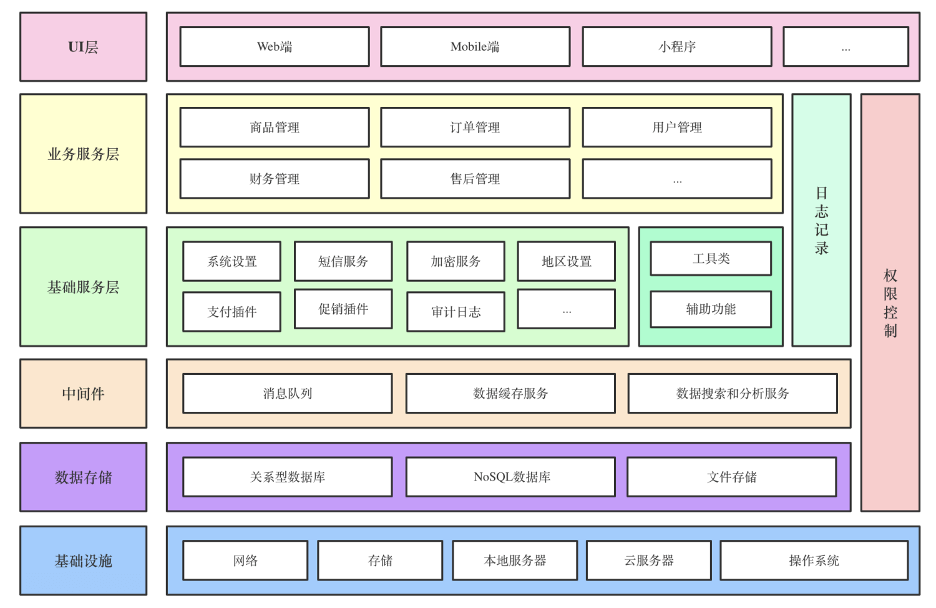
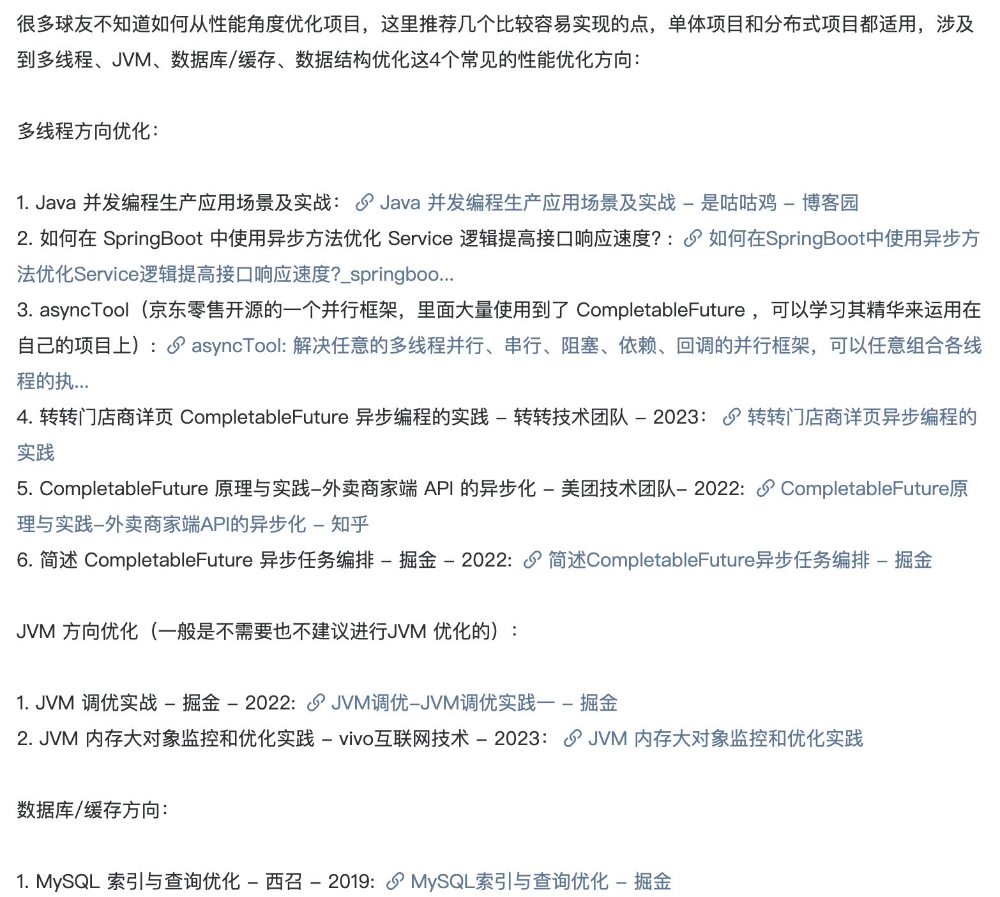
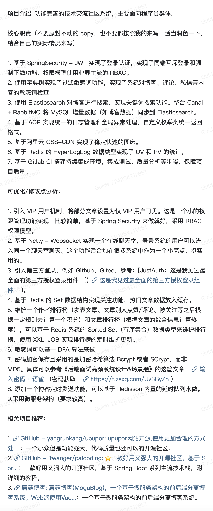
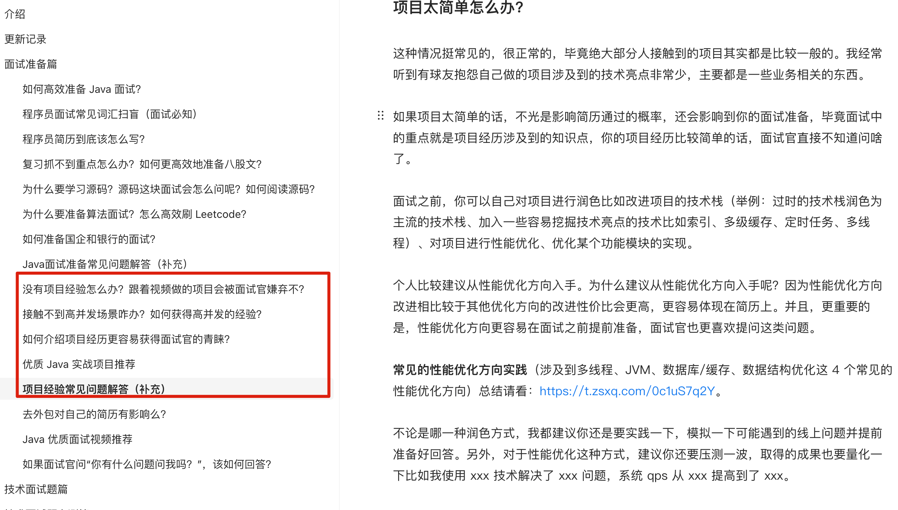
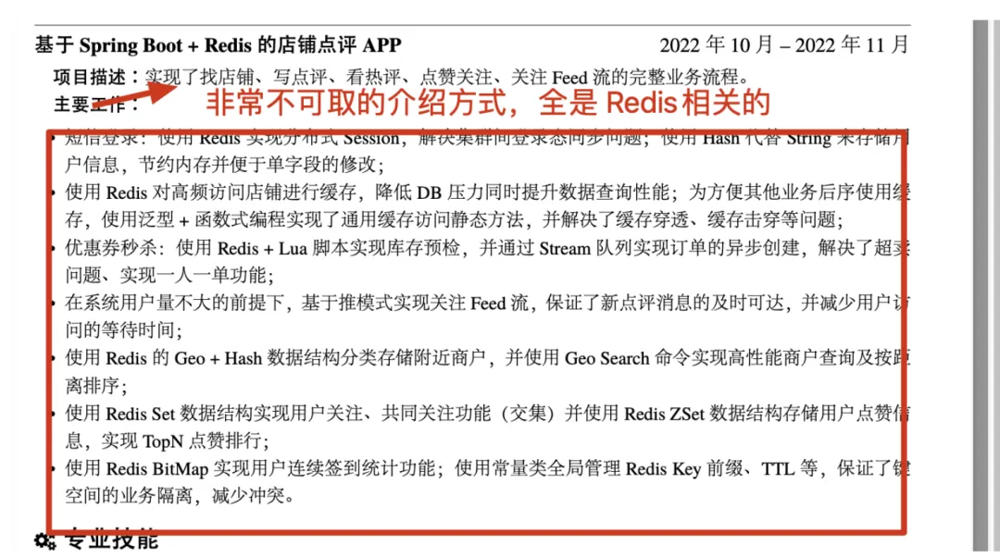
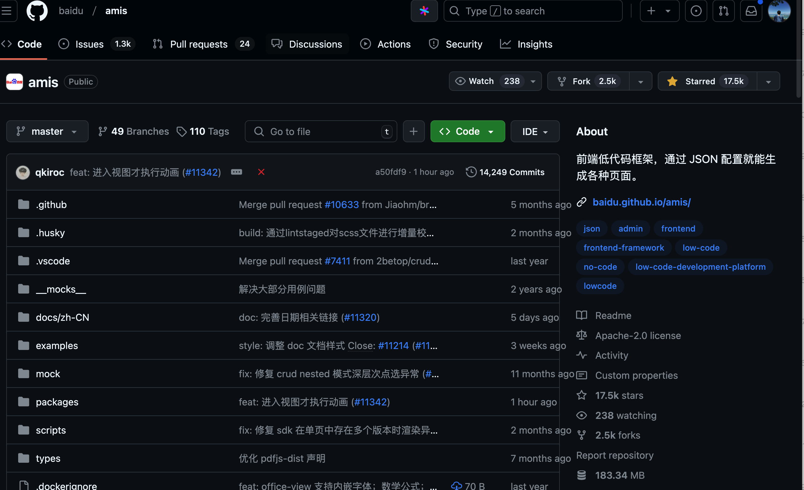
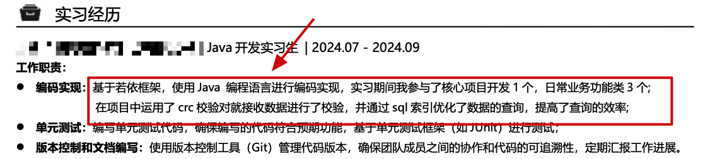
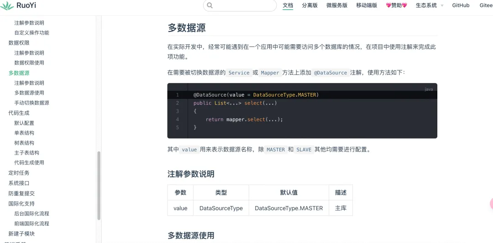
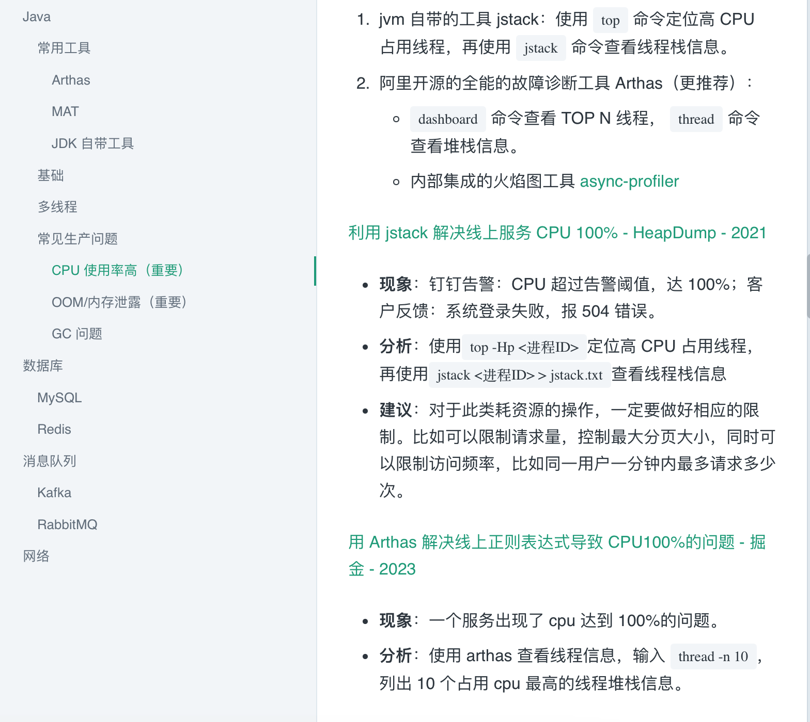

# ⭐项目经验常见问题解答（补充）

如果你的学历比较一般的话，格外注意要把重心放在自己的项目经历上。投递简历之前，思考一下：自己的项目经历是否有亮点？是否还有亮点未被挖掘？是否吃透项目经历中的涉及到的知识点？.....

建议你先整理完善自己的项目经历，再去吃透项目经历上对应的知识点。在学习对应的知识点的过程中，反过来进一步完善自己的项目经历，相辅相成。

如果你没有项目经验的话，建议你尽量一边学习各种框架和中间件一边做一个完整且有一些亮点的项目作为自己的项目经验。

你面试中的重点就是你的项目经历涉及到的知识点，如果你的项目经历比较简单的话，面试官直接不知道问啥了。另外，你的项目经历中不涉及的知识点，但在技能介绍中提到的知识点也很大概率会被问到。像 Redis 这种基本是面试 Java 后端岗位必备的技能，我觉得大部分面试官应该都会问。

一个项目的话不是不可以，但你一定要保证这个项目不能太鸡肋。如果太鸡肋的话，简历关可能就直接 pass，而且面试官提问都不好提。

### ⭐面试官一般如何考察项目经历?

不同面试官考察项目经历的风格略有不同，但大体思路都是相似的。

大部分面试官会先让你简单介绍一下你的项目，以考察你对项目的了解程度。你可以从项目背景、核心功能、技术栈、自己主要负责的功能、亮点、难点、个人收获等角度去准备项目介绍。实际面试的时候，根据具体情况和要求去介绍项目即可，注意表达简洁，突出重点。

在你介绍的期间，面试官也会去看你写在简历上的项目经历介绍。如果你介绍到他想深入了解的点，他可能还会打断你，提一些项目技术实现相关的问题（后面有总结），让你进行详细介绍。

一些面试官还很可能会以直接提问的方式询问项目基本情况。项目基本情况常见问题考察：

1. 这个项目主要是做什么的？是真实的项目的吗？
2. 你在这个项目中主要做了哪些工作？
3. 聊聊项目的亮点？
4. 项目开发过程中有没有遇到什么困难？如何解决的？
5. 通过这个项目，你最大的收获是什么？
6. ……

了解了项目的基本情况之后，面试关一般就会开始对项目技术实现提问了。项目技术实现常见问题考察：

1. 项目是如何上线的？
2. 画一下系统的架构图。
3. 介绍一下 xxx 模块或功能的数据库表设计。
4. 介绍一下 xxx 功能的具体实现。
5. 系统的 xxx 功能为什么使用 xxx 技术实现？
6. 系统的 xxx 功能有其他实现方案吗？
7. ……

这里的重点是把你项目经历上写的工作内容给吃透搞懂，面试官一般不会问你工作内容之外的技术实现。

需要注意的是，面试官通常还会针对你的项目用到的技术进行深挖，考察你的技术功底。比如你的项目用到了缓存 Redis，那面试官就可能会追问你 Redis 相关的问题也就是 Redis 八股。甚至说，有的面试官会给你提出一些挑战性的问题，比如让你解决一些项目中遇到的或者可能遇到的问题、扩展一些项目中没有实现的功能、对比一下不同的技术方案。

### ⭐如何准备项目经历的回答？

上面已经介绍了面试官一般会如何考察项目经历。这里再介绍一下作为求职者，我们可以从哪些方面去准备项目经历的回答：

1. 你对项目基本情况（比如项目背景、核心功能）以及整体设计（比如技术栈、系统架构）的了解（面试官可能会让你画系统的架构图、让你讲解某个模块或功能的数据库表设计）
2. 你在这个项目中你担任了什么角色？负责了什么？有什么贡献？（具体说明你在项目中的职责和贡献）
3. 你在这个项目中是否解决过什么问题？怎么解决的？收获了什么？（展现解决问题的能力）
4. 你在这个项目用到了哪些技术？这些技术你吃透了没有？（举个例子，你的项目经历使用了 Seata 来做分布式事务，那 Seata 相关的问题你要提前准备一下吧，比如说 Seata 支持哪些配置中心、Seata 的事务分组是怎么做的、Seata 支持哪些事务模式，怎么选择？）
5. 你在这个项目中犯过的错误，最后是怎么弥补的？（承认不足并改进才能走的更远）
6. 从这个项目中你学会了那些东西？学会了那些新技术的使用？（总结你在这个项目中的收获）

另外，强烈推荐你看看这篇文章：

[如何介绍项目经历更容易获得面试官的青睐？](https://www.yuque.com/snailclimb/mf2z3k/hlxtez9yy1hfc2y1)

### 如何介绍项目架构？

如果在面试中被问到项目架构，条件允许的情况下，建议画一下项目应用架构简略图，然后对照着图来讲。项目应用架构简略图需要展示出系统的分层结构，包含业务逻辑层、中间件层、数据存储层等。

商城系统应用架构图示例：

在介绍项目架构的时候，可以包含以下信息：

1. 分层结构：介绍系统的各个层次，每一层的作用是什么？
2. 服务划分&通信方式：如果是微服务项目的话，需要详细介绍服务是如何划分的以及各个服务之间的通信方式。
3. 技术选型：说明项目中使用的主要技术例如框架、数据库，它们的作用是什么？为什么这样选择？如果有技术亮点，可以重点介绍一下。
4. 安全：介绍项目中实施的安全措施，如用户身份认证、权限控制、数据加密。
5. 监控：介绍项目使用的监控系统，监控指标以及告警机制。
6. 部署方式：项目是如何被部署的，服务器还是 Docker/Kubernetes 或者是其他部署方式？
7. 挑战与解决方案：介绍你在架构设计过程中遇到的挑战以及你是如何解决这些问题的。
8. 改进建议：没有完美的项目架构，时间允许的情况下，可以聊聊你对如何改进当前项目架构的看法。

相关阅读：[架构设计类别有哪些？如何画好架构图？](https://t.zsxq.com/10WSVehJc )。

### ⭐简历上的项目太简单怎么办？

这种情况挺常见的，很正常的，毕竟绝大部分人接触到的项目其实都是比较一般的。我经常听到有球友抱怨自己做的项目涉及到的技术亮点非常少，主要都是一些业务相关的东西。

项目太简单主要会导致两个问题：

1. 如果你的项目经历太简单，主要都是一些业务或者 CRUD 相关内容的话，一般就会直接卡在简历筛选这一步，面试机会很少很少，甚至没有面试机会。
2. 对技术面试不太友好，毕竟有水平的面试官主要都是根据项目经历去问一些技术问题。如果你的项目经历太简单，面试官很难去提问，你自己也没办法通过项目经历来缩小技术面试的重点范围。

**如果自己的项目太简单的话，如何去弥补呢？**

有几点方法可以参考：

1. 参与开源项目，在开源项目的基础上进行学习改进，包装成真实的项目。开源项目建议优先选择自己过往工作中接触过的业务类型，这样能更快上手，也更容易包装成真实的项目。Java 类的实战开源项目可以参考我的总结：[Java 优质开源实战项目](https://javaguide.cn/open-source-project/practical-project.html) ，里面有很多非常赞的项目。
2. 对自己过往的项目进行改进完善，例如加入一些性能优化、对原项目的一些技术实现进行修改、新增一些合适的功能等等。这是我比较推荐的一种方法，也是绝大部分求职者采用的办法（下面会详细介绍到如何优化自己的项目）。
3. 在网上找一个符合自己能力与找工作需求的实战项目视频或者专栏，跟着教程一起做。跟着教程做的过程中，你一定要有自己的思考，不要浅尝辄止。对于很多知识点，别人的讲解可能只是满足项目就够了，你自己想多点知识的话，对于重要的知识点就要自己学会去深入学习。另外，不要完全按照原教程来，尤其是那种热门项目（很容易和别人撞车），适当加入一些不一样的东西，比如简单改变一下技术选型、优化一下原项目的某个模块的技术实现。
4. 自己动手去做一个自己想完成的东西，遇到不会的东西就临时去学，现学现卖。这个对个人能力要求比较高，但也是对个人能力提升最有帮助的一种方式。

另外，知识星球里分享了网盘项目、RPC 项目（附带教程）。并且，已经更新了博客/论坛项目、校园订餐/外卖系统等“烂大街”项目的介绍模板和优化思路（正在持续补充）。传送门：[星球项目资料合集（持续更新中）](https://t.zsxq.com/Xlozm)。

### ⭐如何优化自己的项目?

如果项目太简单的话，不光是影响简历通过的概率，还会影响到你的面试准备，毕竟面试中的重点就是项目经历涉及到的知识点，你的项目经历比较简单的话，面试官直接不知道问啥了。

面试之前，你可以自己对项目进行润色比如改进项目的技术栈（举例：过时的技术栈润色为主流的技术栈、加入一些容易挖掘技术亮点的技术比如索引、多级缓存、定时任务、多线程）、对项目进行性能优化、优化某个功能模块的实现。

个人比较建议从性能优化方向入手。为什么建议从性能优化方向入手呢？因为性能优化方向改进相比较于其他优化方向的改进性价比会更高，更容易体现在简历上。并且，更重要的是，性能优化方向更容易在面试之前提前准备，面试官也更喜欢提问这类问题。

**常见的性能优化方向实践**（涉及到多线程、JVM、数据库/缓存、数据结构优化这 4 个常见的性能优化方向）总结请看：[https://t.zsxq.com/0c1uS7q2Y](https://t.zsxq.com/0c1uS7q2Y) 。

不过，也要避免你的项目经历的个人职责介绍都是性能优化相关的，这种也算是一个极端。

除了性能优化这种方式之外，你还可以对原项目的一些技术实现进行修改完善或者新增一些合适的功能。

技术实现可以是对现有的技术选型进行改变，也可以是对现有功能的技术实现进行优化。例如，你可以：

+ 根据业务需求提取通用组件：
    - [基于AOP思想构造RocketMQ组件](https://mp.weixin.qq.com/s/IScqWEMyaFRvYe3sKo_KEQ)
    - [Redis + AOP + 自定义注解实现接口限流](https://www.cnblogs.com/blbl-blog/p/17944006)
    - [造轮子记录——内存攒批队列设计](https://juejin.cn/post/7338605981594894399)
    - [EasyExcel 封装](https://github.com/pig-mesh/excel-spring-boot-starter)
+ 将项目使用的 MQ 换成其他更合适的 MQ(也可以是其他中间件)：
    - [从RabbitMQ平滑迁移到RocketMQ技术实战](https://mp.weixin.qq.com/s/O5ESWxvepGug9zNqSElWUA)
    - [从RabbitMQ平滑迁移至Kafka架构设计方案 | HeapDump性能社区](https://heapdump.cn/article/5439218)
+ 将项目的部署方式更改为更便捷的部署方式：
    - [你的项目用到了Jenkins，有什么用？](https://www.yuque.com/snailclimb/mf2z3k/uba4g8fvxmkvvodl)
    - [Docker+Nginx 打包部署前后端分离项目](https://cloud.tencent.com/developer/article/2225334)
    - [docker-compose 容器编排部署](https://cloud.tencent.com/developer/article/2225328)
+ 将项目的日志记录方式更改为更优雅的方式：
    - [日志记录方案有哪些？](https://www.yuque.com/snailclimb/mf2z3k/srwasy4ubg4htbzg)
    - [服务治理：分布式下如何进行日志管理？](https://www.yuque.com/snailclimb/mf2z3k/ma1byh)
+ ......

新增功能需要根据项目具体情况来分析，例如博客/论坛类项目可以加入文章和作者排行榜功能、博客定时发送等功能，网盘/文件系统类项目可以加入文件分享、文件加密等功能。

个人建议多种优化方式搭配着来，效果会更好一些。

下面是一些适用于绝大部分业务系统的功能，通用性很强：

+ 引入第三方登录，例如 Github、Gitee、微信，具体思路可以参考我在星球的分享：[https://t.zsxq.com/18ZIzSBPH](https://t.zsxq.com/18ZIzSBPH) 。
+ 基于 Netty + Websocket 实现一个在线聊天室，登录系统的用户可以进入同一个聊天室聊天。
+ 实现常见文件类型（例如 doc、docx、ppt、pptx 等等）的在线预览功能，具体思路可以参考我在星球的分享：[https://t.zsxq.com/19Kp1fAoI](https://t.zsxq.com/19Kp1fAoI) 。

[星球项目资料合集（持续更新中）](https://t.zsxq.com/Xlozm )目前已经更新了博客/论坛项目、校园订餐/外卖系统等“烂大街”项目的介绍模板和优化思路，非常值得借鉴参考，里面很多东西都可以直接拿来用，适合很多类型的项目。

不论是哪一种润色方式，我都建议你还是要实践一下，模拟一下可能遇到的线上问题并提前准备好回答。另外，对于性能优化这种方式，建议你还要压测一波，取得的成果也要量化一下比如我使用 xxx 技术解决了 xxx 问题，系统 qps 从 xxx 提高到了 xxx。

**如果实在没有时间和精力的话，那也不必要真正去实际落实到项目上，搞懂吃透具体做法和原理，准备一下面试可能会被问到的问题，能应对住面试官的考查就好了！**

另外，《Java 面试指北》中还有几篇项目经历相关的文章，推荐你认真看看。

### 项目来源怎么说？必须是真实项目吗？

项目的来源其实不太重要，校招生没有那么多真实的项目可以做，这个面试官心里都清楚。你想要将学习项目包装为真实的项目，你首先得有能力让其像是一个真实的项目。很多学习项目都是为了用技术而用技术，本身一看就是并发量不高的业务，还各种强行用缓存和消息队列，完全不考虑是否真的适合业务场景，这种情况一看就是包装的。

很多同学非常容易陷入“项目包装”的误区，项目的确需要多加入一些亮点，但强行堆砌技术非常不合适！ 之前看很多同学的项目经历，恨不得所有业务场景都用上 Redis、消息队列等技术来体现项目的“高并发”。

与其追求“高大上”的技术堆砌，不如深入挖掘项目中的实际挑战，并选择最合适的技术方案来解决问题。举例如下：

1. 对于高频数据采取 Redis 进行缓存并介绍如何解决穿透、击穿等问题。除了使用缓存之外，数据库本身的优化同样需要关注，比如：针对查询条件建立合适的索引，以及针对读多写少的场景进行读写分离。
2. 如果项目涉及异步处理，不一定非要上分布式消息队列，单体项目CompletableFuture、线程池、内存队列等方式都可以。如果是分布式项目上消息队列的话，可以进一步介绍一下如何保障消息的可靠性、顺序性、以及如何处理重复消费、消息丢失等问题。

面试官更关注你的是你的技术能力以及对你做的项目的熟练程度。即使你说项目是学习项目，但你在面试中展现出不错的技术能力，对项目挖掘的很深，那同样是可以给面试官留下很好的印象。

我在知识星球分享了网盘项目、RPC 项目（附带教程）、动态线程池。并且，已经更新了博客/论坛项目、校园订餐/外卖系统等“烂大街”项目的介绍模板和优化思路（正在持续补充）：[星球实战项目资料合集](https://t.zsxq.com/Xlozm) 。

### 项目必须完整做完吗？

很多同学有一个误区就是项目必须完整做完之后才能写在简历上，实际不然，真实项目也不可能你一个开发，一般都是一个团队。

从写简历的角度来说，只要你能写出 6~8 条比较有亮点的个人职责介绍，这个项目就可以被写在简历上。不过，你必须保证你把写在简历上的东西给搞懂吃透。从个人学习角度来说，还是尽量要把一个项目给完整做完，多多动手实践一下。

强烈不推荐直接拿网上的项目直接用的这种行为，容易在面试中暴露出问题，面试官稍微深挖一点，问的细节一点，可能就会发现你实际并不是很了解这个项目，对一些项目细节不够了解。

我遇到很多球友的项目经历描述几乎一模一样，我严重怀疑是网上找的模板拿来直接使用了，一定一定一定要避免这种情况。你可以参考别人的项目经历描述，但一定不要直接抄袭！

### 想要自己动手做一个完整的前后端项目，但是不会前端怎么办？

可以找一些现成的前端模板或者满足你的项目需求的前端开源项目，直接在其基础上进行修改定制。如果前后端都自己做的话，那还是得稍微会一点前端。

现在有 AI 辅助编码，写前端其实也挺简单的，掌握了基本的前端基础，AI编码辅助+照葫芦画瓢就够了！

再或者，你也可以借助前端低代码框架，例如百度开源的 Amis，其通过 JSON 配置就能生成各种后台页面，包括数据获取、表单提交及验证等功能，同时，Amis 内置 100+ 种 UI 组件，能够满足各种页面组件展现的需求，极大减少开发成本，甚至可以不需要了解前端。

### 必须是微服务项目才有亮点？

个人认为也没必要非要去做微服务或者分布式项目，不一定对你面试有利。微服务或者分布式项目涉及的知识点太多，一般人很难吃透。并且，这类项目其实对于校招生来说稍微有一点超标了。即使你做出来，很多面试官也会认为不是你独立完成的。

其实，你能把一个单体项目做到极致也很好，对于个人能力提升不比做微服务或者分布式项目差。如何做到极致？代码质量这里就不提了，更重要的是你要尽量让自己的项目有一些亮点（比如你是如何提升项目性能的、如何解决项目中存在的一个痛点的），项目经历取得的成果尽量要量化一下比如我使用 xxx 技术解决了 xxx 问题，系统 qps 从 xxx 提高到了 xxx。

### 可以说项目经历是基于脚手架开发的吗？

最近发现不少读者在描述项目经历的时候，踩了一个小坑，直接明说自己的项目是基于某某脚手架开发的，生怕面试官不知道。

个人建议在描述项目经历时，即使你的项目确实是基于脚手架进行开发的，也应该尽量避免直接提及使用了脚手架。脚手架通常提供了一套预先配置好的基础功能例如认证登录、权限管理、部门管理，开发者在此基础上进行修改和调整。虽然这确实适合很多中小企业，能够极大地提高开发效率，降低成本，但技术含量相对较低。因此，**直接提到使用脚手架可能会让面试官误以为你的工作主要是简单的配置和调整，觉得你并发没有什么实际的开发能力。**

除了会让面试官怀疑你的开发能力之外，你说项目是基于脚手架做的之后就很难去在简历上描述项目经历了，脚手架实现的功能你说是自己实现的，总感觉有点不太合适。

以大家用得比较多的脚手架[**若依**](https://ruoyi.vip/)为例，它已经实现了不少不错的功能，例如定时任务、多数据源、数据脱敏、防重复提交等。如果你在项目中使用了类似的脚手架，可以深入研究这些功能的实现逻辑，理解其原理，并将其包装成你在项目中做的工作，尽量将这些功能适配到你的项目的实际业务场景中。

甚至说，你觉得若依某些模块的功能实现方式有更好的方式，完全可以替换一下。现实是，若依确实也存在很多不那么好的地方，很多功能实现不够规范，代码整体质量稍微有点差。

有非常多在若依框架基础上改进得来的优秀开源项目，其中 [AgileBoot-Back-End](https://github.com/valarchie/AgileBoot-Back-End) 就是一个很好的例子。这个项目在若依的基础上做了大量的重构和优化，提升了代码规范性、可维护性以及项目的整体质量。如果你能够在项目中做出类似的改进，那无疑会给面试官留下深刻的印象。

### ⭐如何回答项目遇到什么困难，如何解决这类问题？

这是一个比较常见的问题，面试被问项目经历的时候经常会碰到。

**切记！！！一定要提前准备，不然被问到就无了，比较影响面试官对你印象。**

你可以在面试之前思考一下项目进行过程中有没有遇到过什么棘手的问题，生产问题、性能问题或者业务问题皆可。相对来说，生产问题和性能问题更有说服力一些，也更容易准备一些。即使不是你自己遇到的问题，你也可以拿来用，只要你搞懂吃透就行了，注意适当润色。

不过，如果你平时不注意思考总结或者项目整体比较简单的话，可能感觉并没有遇到什么比较棘手的问题。

这个时候，你可以从项目技术栈来研究一下，看看项目在使用这些技术的时候可能会遇到哪些生产问题。如果想不出来的话，也没关系，根据技术关键词去搜相关的生产问题案例（我之前分享过一些线上常见问题案例：[https://t.zsxq.com/0dobVUIx7](https://t.zsxq.com/0dobVUIx7) ，建议抽空看看，内容涵盖CPU飙升、OOM 问题、GC 问题等常见生产问题的排查和多线程、数据库、消息队列等生产问题案例）。参考别人遇到遇到的生产问题，再结合自己项目的具体情况，改编成自己的就好。不过，一定要搞懂吃透，避免面试的时候回答不上来。类似地，性能问题也是同样的思路。

### ⭐线上问题（比如OOM、慢接口）如何排查？有哪些常见的工具？

面试中经常会遇到线上问题排查相关的问题，尤其是社招面试，常见的问法有：

1. 你在做这个项目的时候遇到了什么问题？（OOM问题、GC问题等等）
2. 你用过哪些分析定位 Java 故障/性能的工具？（JDK 自带工具、MAT、Arthas 等等）
3. 如果项目遇到了 OOM 问题，你会如何排查？（常用 MAT）
4. 有什么办法可以监控到 JVM 的实时运行状态？（Arthas）
5. 生产环境有一个接口很慢，如何排查？（Arthas）
6. 你是如何定位线上问题的？（说说自己了解的工具，然后根据面试官提示继续深入聊即可）
7. 项目中遇到了哪些线上故障，你是如何解决的？
8. ......

这些问题属于半开放式的，没有特别规定的答案。推荐阅读我整理的线上常见问题案例和排查工具：[https://t.zsxq.com/0fobVUIx7](https://t.zsxq.com/0fobVUIx7) （之前分享过一次，又进一步完善了一波）。

### 面试官问我负责了哪些模块，怎么回答？

面试时间有限，不太可能把每个模块都介绍的很清楚，我们这里以用户认证模块为例介绍应该如何回答：

1. 直接清晰地说明你负责的模块名称。例如：“我在XX项目中主要负责用户认证模块的开发和维护。”
2. 用简洁的语言描述该模块的功能，以及它在整个项目中的作用和重要性。例如：“用户认证模块是整个系统的入口，负责用户登录、注册、密码管理等功能，它直接关系到系统的安全性和用户体验。”  这部分要突出你负责模块的价值，让面试官意识到这不是一个无关紧要的模块。
3. 详细描述你在该模块中承担的职责和完成的工作，并量化你的成果。例如：“我独立完成了用户认证模块的核心代码编写，并实现了基于 OAuth 2.0 的第三方登录功能，将用户注册转化率提升了15%。”  这部分要展现你的技术能力和解决问题的能力。  可以使用一些关键词，比如“优化”、“重构”、“设计”、“实现”、“提升”、“解决”等，来突出你的贡献。
4. 简要提及你在开发过程中遇到的技术挑战，以及你如何克服这些挑战。例如：“在开发过程中，我遇到了一些性能瓶颈，通过使用 Redis 缓存和优化数据库查询，最终解决了这个问题。”  这部分是关键，你需要有意识地引导面试官提问你擅长的技术点。  不要深入展开技术细节，点到为止，等待面试官追问。

建议你看看顺带着看下面这篇文章：

[如何介绍项目经历更容易获得面试官的青睐？](https://www.yuque.com/snailclimb/mf2z3k/hlxtez9yy1hfc2y1)

### 面试被问项目的 TPS、QPS 多少，怎么办？

校招简历，绝大部分同学的项目都不是真实的项目经验，那我们应该如何回答项目的 TPS、QPS 等性能指标这类问题呢？

开始回答这个问题之前，先分享几个常见的性能指标：

+ **TPS (Transactions Per Second):** 每秒处理的事务数。一个事务可以包含多个请求。例如，一个电商下单事务可能包含添加商品到购物车、填写收货地址、支付等多个操作。
+ **QPS (Queries Per Second):** 每秒处理的请求数。例如，一个用户访问网站的首页算作一个请求。
+ **并发数**：并发数可以简单理解为系统能够同时供多少人访问使用也就是说系统同时能处理的请求数量。
+ **吞吐量**：吞吐量指的是系统单位时间内系统处理的请求数量。

下面分享一下我对回答这类问题的建议：

1. 多找一些相关的技术博客看看，关键词是性能优化，例如 Redis 性能优化、数据库优化等等。另外，一些开源项目会提供一些示例配置和性能测试结果，可以作为参考。
2. 自己使用压测工具（例如 JMeter、Apache Bench、Gatling 等）模拟真实场景下的并发访问，例如模拟用户登录、下单等操作，并通过调整并发用户数、Ramp-up 时间等参数来观察不同配置下的 TPS、QPS、响应时间等指标的变化。
3. 不要试图记住具体的数字，因为不同业务场景下的性能指标差异很大。更重要的是理解这些指标的含义，以及如何根据实际情况进行调整。
4. 将你学到的知识和你的项目经验结合起来，例如 "我在之前的项目中使用了 Redis 作为缓存，为了提高可用性和性能，我们采用了 Redis Cluster 方案..."。 即使你的项目经验有限，也可以尝试将这些知识应用到你的项目中，并进行一些模拟测试。
5. 不要夸大其词，不要试图将其强行包装成大厂高并发项目的访问量，意义不大，反而容易露馅。

一些常见软件的理论 QPS，例如单机 Nginx 可以达到 30w +、单机 Redis QPS 可以达到 8w+、 单机 MySQL QPS 大概在 4k 左右、单机 Tomcat 的 QPS 在 2w 左右。

不过，QPS 会受到多种因素的影响，几乎不可能达到这些理论值。 需要根据具体硬件、软件配置、以及测试方法的不同而变化。 单纯记住这些数字意义不大，更重要的是理解影响 QPS 的因素以及如何优化：

+ **Nginx (30w+ QPS):** Nginx 作为反向代理和负载均衡器，其性能非常出色。30w+ QPS 的说法主要针对静态文件服务，并且在优化配置和高性能硬件的条件下才能达到。如果涉及到动态内容处理或 SSL 加解密，QPS 会显著下降。
+ **Redis (8w+ QPS):** Redis 以其高性能内存数据库著称。8w+ QPS 通常指简单的 GET/SET 操作，并且在客户端和服务器网络连接良好的情况下才能实现。复杂操作或大量数据传输会降低 QPS。
+ **MySQL (4k QPS):** MySQL 的 QPS 受到很多因素的影响，包括硬件配置、数据库设计、查询语句的复杂度、索引优化等等。4k QPS 是一个比较常见的数值，但实际情况可能远低于或高于这个数字。 简单的查询可以达到更高的 QPS，而复杂的查询可能会降低到几百甚至几十。
+ **Tomcat (2w QPS):** Tomcat 的 QPS 同样取决于许多因素，例如硬件配置、应用代码的效率、JVM 参数调优等等。2w QPS 是一个可能的数值，但实际情况可能会有很大差异。 复杂的业务逻辑或高并发访问都会降低 QPS。

> 更新: 2024-12-11 11:41:30  
> 原文: <https://www.yuque.com/snailclimb/mf2z3k/redsrr>