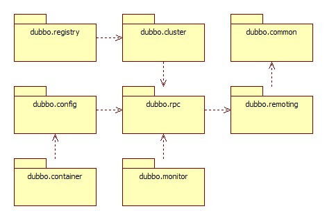
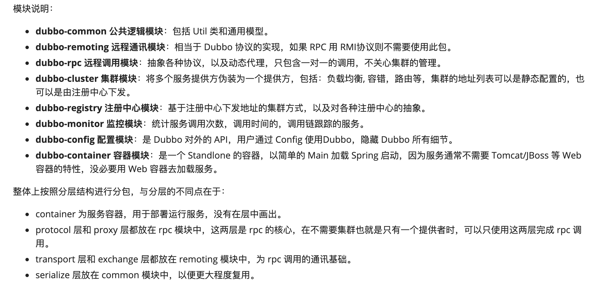
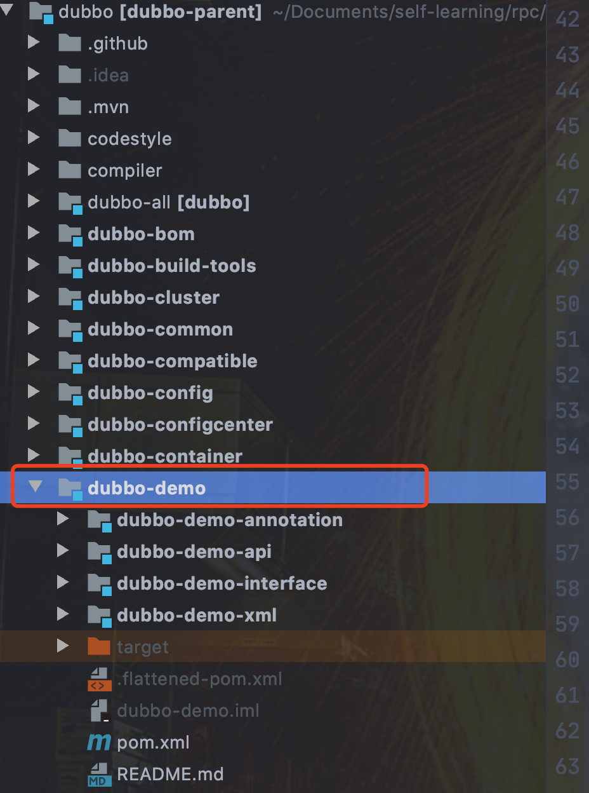
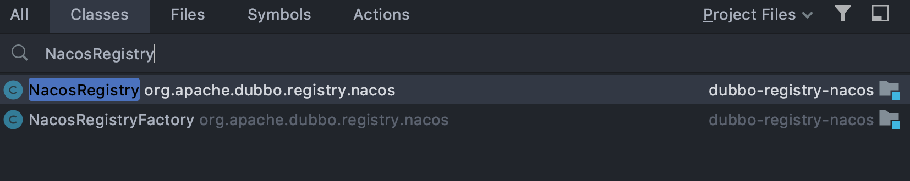
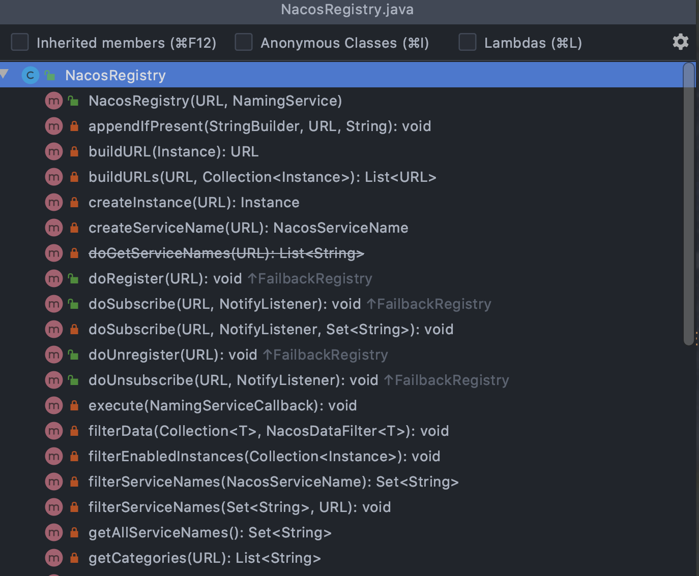
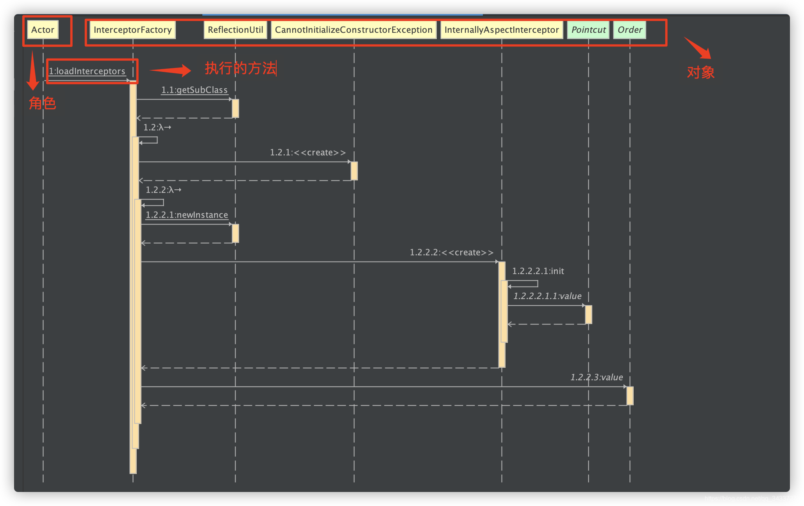

# 为什么要学习源码？源码这块面试会怎么问呢？如何阅读源码？

## 为什么要学习源码？

### 学习优秀的代码实践

如果我们沉浸在自己的世界，整天 CRUD，实际是很难提高自己的编码能力，重复编码提升的不过是熟练度罢了!

如果我们想要写出质量更高、扩展性更好的代码，我们要做的事情非常简单：**看一些技术大佬是怎么写的，模仿就完事了。**

**这个模仿不同于照葫芦画瓢，我们需要搞懂优秀设计背后的原理。**

那怎么检验自己是否掌握了呢？很简单，看自己能不能在后续的编码中实践就好了。但是，切记不要为了用“好的编码实践”而用，一切要结合业务实际需要。

一些不错的开源项目，都是一些技术大佬们几个月甚至是几年的成果。只要肯花时间看，我们一定能从源码中学到很多东西。

我们需要重点关注源码中的这些点：

+ 如何抽象接口的？
+ 如何运用设计模式的？
+ 如何实践 SOLID 软件设计原则的？
+ 有哪些优秀的编码实践？
+ ......

### 借鉴

如果我们想要设计一个类似的框架或者轮子的话，参考已有的优秀框架不失为一个好手段。俗话说的好：“他山之石可以攻玉”。

我们平时接触到的很多开源项目都是例子，比如阿里开源的消息队列 RocketMQ 就借鉴了 Kafka 。

### 面试需要

据我观察，大部分真正愿意去看源码的朋友都是为了面试。这些朋友会找到对应框架比较重要的部分来学习源码，拿 Spring Boot 来说的话，就是 Spring Boot 启动流程、自动配置原理...。

确实，短时间内突击源码，我们一定要重点关注那些重要的地方。

但是，这种为了面试而突击源码的方式，往往很难真正学到源码的精髓，能收货的东西也会很有限。

### 项目需求

很多时候，我们阅读源码是因为项目需要。

比如说我们的项目在前期引入了某个开源框架，但是到项目中期的时候，我们发现这个开源框架并不能很好地满足我们的需求，甚至说还有一些小 bug 。与这个开源框架相关的负责人员交涉之后，我们的反馈并没有得到响应。这个时候， 我们就需要自己去实现某些功能以及修复某些 bug。想要做这些事情的前提是：我们当前对这个开源框架某一块的源码比较熟悉了。

## 源码面试这块会怎么问？

首先，你需要明确一点的是：**随便一个框架的源码都 10w+行了，都看一遍是不可能的。你需要挑选比较重要的地方看。**

拿 Spring/Spring Boot 源码举例：你一定要去看 IOC 和 AOP 具体的实现，要知道一个 Spring Bean 是如何一步一步被创建出来的。一定要搞清 Spring Boot 是如何实现自动配置的。

源码面试这个不会太细节。如果你知道的话一定是加分项，不知道的话不一定就会被 pass。不过你写简历的时候尽量写清楚点，写清楚自己看过哪部分的源码。

平时学习过程中，有时间的话可以多看看源码，对于提升自己的能力非常有帮助！

如果你不知道阅读什么源码的话，可以先从 JDK 的几个常用集合看起。另外，我比较推荐看 Dubbo 的，因为感觉会稍微相对容易一点，模块划分清晰，注释也比较详细。搞清楚了 Dubbo 基本的原理之后，看起来就没那么吃力了。

## 有哪些值得阅读的优秀源码？

> 下面有部分内容是摘自朋友写的一篇文章：[《如何提升代码质量 - Thoughtworks 洞见》](https://insights.thoughtworks.cn/how-to-improve-code-quality/)
>

### JDK

**为什么要看 JDK 源码？**

1. JDK 源码是其它所有源码的**基础**，看懂了 JDK 源码再看其它的源码会达到事半功倍的效果。
2. JDK 源码中包含大量的**数据结构**知识，是学习数据结构很好的资料，比如，链表、队列、散列表、红黑树、跳表、桶、堆、双端队列等。
3. JDK 源码中包含大量的**设计模式**，是学习设计模式很好的资料，比如，适配器模式、模板方法模式、装饰器模式、迭代器模式、代理模式、工厂模式、命令模式、状态模式等。
4. JDK 源码中包含大量 Java 的**高阶知识**，比如弱引用、Unsafe、CAS、锁原理、伪共享等，不看源码是很难学会这些知识的。

**JDK 源码阅读顺序** ：

1. `java.lang` 包下的基本包装类(`Integer、Long、Double、Float` 等)，还有字符串相关类(`String、StringBuffer、StringBuilder` 等)、常用类(`Object、Exception、Thread、ThreadLocal`等)。
2. `java.lang.ref` 包下的引用类(`WeakReference、SoftReference` 等)
3. `java.lang.annotation` 包下的注解的相关类
4. `java.lang.reflect` 包下的反射的相关类
5. `java.util` 包下为一些工具类，主要由各种容器和集合类(`Map、Set、List` 等)
6. `java.util.concurrent` 为并发包，主要是原子类、锁以及并发工具类
7. [java.io ](http://java.io/)和 `java.nio` 可以结合着看
8. `java.time` 主要包含时间相关的类，可以学习下 Java 8 新增的几个
9. [java.net ](http://java.net/)包下为网络通信相关的类，可以阅读下 `Socket` 和 `HTTPClient` 相关代码

源码量那么大，不要妄想一口气都看完。最好符合你当前的目的，比如你想搞懂多线程，你就主要看 JUC，想搞懂 IO 就多去看 NIO，想看常量池就去看 ClassFileParser。看模块的时候，要注意接口大于一切，或者说函数大于一切。先不要妄想搞懂所有细节，先找几个比较关键的函数，搞懂函数的作用（比如应该仔细分析一下函数名称和参数名称）然后再往下进行。

在看 Java 类库的时候要多注意类是不是 abstract 的，是不是用的模板方法，多关注函数前的修饰词，这一般说明这个函数是给谁用的。多注意这些细节而不是傻傻过一遍逻辑，能从里面学到不少关于设计的东西。还可以注意什么地方是为了之前的设计而委曲求全的做法，毕竟一个这么多年的类库，肯定不是什么地方都是完美的。

JDK 源码一定要看 Java 并发相关的源码， Doug Lea 的并发源码比较漂亮，一行行都是精华，非常值得阅读学习。

### Spring

Spring 是一个开源的设计层面框架，它解决的是业务逻辑层和其他各层的松耦合问题，因此它将面向接口的编程思想贯穿整个系统应用。包括在此基础上衍生的 Spring MVC、 Spring Boot 、Spring Cloud 等，在现在企业中的应用越来越广泛。无论是设计思想，代码规范，还是设计模式，接口设计，类加载，都是非常优秀的源码。

个人学习心得如下：先去看视频，大概熟悉一下 Spring 的使用情况，然后再去学习源码，此处可以阅读[《Spring 源码深度解析》](https://book.douban.com/subject/25866350/)，除了看书之外，记得打开 IDEA 查看对应的源码，如果能调试看看具体调用逻辑那就更好了。

### Google Guava

[Google Guava](https://github.com/google/guava) 是 Google 公司内部 Java 开发工具库的开源版本。Google 内部的很多 Java 项目都在使用它。它提供了一些 JDK 没有提供的功能，以及对 JDK 已有功能的增强功能。其中就包括：集合（Collections）、缓存（Caching）、原生类型支持（Primitives Support）、并发库（Concurrency Libraries）、通用注解（Common Annotation）、字符串处理（Strings Processing）、数学计算（Math）、I/O、事件总线（EventBus）等等。

### Netty

[Netty](https://github.com/netty/netty) 是一个优秀的开源网络编程框架，我们平常经常接触的 Dubbo、RocketMQ、Elasticsearch、gRPC 等等都用到了 Netty。

Netty 中使用了大量的设计模式以及优秀的设计原则。

### Dubbo

[Dubbo](https://github.com/apache/dubbo) 是一款优秀的国产 RPC 框架，其 SPI 自适应扩展、负载均衡实现、集群实现、服务调用过程等部分的源码都非常值得阅读和学习。

## 保姆级别的源码阅读教学

### 如何高效阅读项目源码

⚠️ 注意：

+ 阅读源码之前，一定要先熟悉项目。你连 Dubbo 怎么使用、RPC 是个啥都不知道，就直接去看 Dubbo 源码的话，不是纯属扯淡么？
+ 阅读源码之前，一定要对项目源码使用的技术有一个最基本的认识。

#### 从了解并使用项目开始

开始看源码之前，自己花一些时间阅读以下官方的文档、使用教程。如果官方文档是英文的话，也可以找一些国人写的博客看看。不知道项目是用法和用途的就去看项目源代码的行为，无疑是在黑夜中穿针。

#### 站在最外层概览项目设计

阅读源码之前，我比较推荐先站在最外层去熟悉项目整体架构和模块分包。掌控全局之后，我们方能以一个更正确的姿势畅游源码的世界。

比如，我在看 Dubbo 源码之前，我就首先花了大量时间熟悉了 Dubbo 的模块分包，这个在其官方文档上介绍的就非常详细。

#### 从某个功能主线/问题出发研究项目源码

一个比较成熟的项目的源码量是非常多，我们不可能都看完。比较推荐的方式就是通过一个功能主线（比如 Dubbo 是如何暴露服务的？）或者问题（比如 SpringBoot 的自动配置原理？）出发。

#### 学会使用官方提供的 Demo

一般情况下，项目源码已经自带了一些 Demo 我们可以直接使用。这样可以方便我们：

+ 检验源码阅读环境是否搭建成功。
+ 调试项目。

比如在 Dubbo 项目源码中，我们找到 `dubbo-demo` 这个文件夹，里面包含了 3 种不同类型（xml、api、annotation）使用方式的 demo，可以帮助我们节省掉大量写 Demo 的时间。

### 有哪些对阅读源码有帮助的建议

#### 学习常见的设计模式、设计原则

一个优秀的开源项目一定会不可避免使用到一些设计模式，如果我们提前不了解这些设计模式的话，会加深自己理解代码的难度。

另外，项目的代码还应该满足一些设计原则。对于，面向对象编程来说，下面这些原则都是我们应该非常熟练的。

1. 面向对象编程的思想（继承、封装、多态、抽象）
2. 面向对象的七大设计原则： 
    - 单一职责原则（Single Responsibility Principle, SRP）
    - 开闭原则（Open Closed Principle，OCP）
    - 里氏代换原则（Liskov Substitution Principle，LSP）
    - 接口隔离原则（Interface Segregation Principle，ISP）
    - 依赖反转原则（Dependency Inversion Principle，DIP）
    - 合成/聚合复用原则（Composite/Aggregate Reuse Principle，CARP）
    - 迪米特法则（Principle of Least Knowledge，PLK，也叫最小知识原则）
3. 软件设计的三大原则 
    - DRY（Don’t Repeat Yourself）原则：不要重复你自己
    - KISS（ Keep It Simple/Stupid）原则：保持简单易懂
    - YAGNI （ You Ain’t Gonna Need It）原则 ：不要进行过度设计

#### 学会看测试类

测试类一方面可以说是对代码的稳定性的保障，让我们对自己写的代码更放心。另一方面测试本身也是对代码的一个说明，因此，很多人都会说：“好的测试即是文档”。通过测试类，我们可以很清楚地知道某一块代码具体是在干嘛。

#### 学会调试

通过调试，我们可以更直观地看到调用逻辑关系。通过变量信息，可以更直观地看到数据的变化过程，这对于我们理解代码以及找 bug 都是非常有帮助的。

IDEA 调试技巧可以看看这篇文章：[如果你也会这样调试，那真是泰酷辣 - 阿里云开发者](https://mp.weixin.qq.com/s/fjMCG17u6EC97A7oSqMSjQ)。

#### 掌握 IDE 常用的快捷键

熟悉常用的快捷键在源码阅读中非常有必要！这个是必须要会的。

比如在 IDEA 中我们通过 command+o(mac)或者 ctrl+n(win/linux)即可搜索类以及文件

通过 command+f12(mac)或者 ctrl+f12(win/linux)即可查看类的结构（函数、变量）

#### 使用一些插件辅助自己

有一些插件可以帮助我们理清源码的调用逻辑。比如 IDEA 插件 SequenceDiagram 就可以帮助我们一键生成方法的时序图。

相关阅读：[《安利一个 IDEA 骚操作:一键生成方法的序列图》](https://mp.weixin.qq.com/s?__biz=Mzg2OTA0Njk0OA==&mid=2247494507&idx=2&sn=50764e6f24f3f48738770154d032dde4&chksm=cea1a4a0f9d62db6da5a45de6ac230eb108fb9bd8d71a93e10e3b0a929b9e01d885f158f80ba&scene=178&cur_album_id=1319419426898329600#rd)

#### 手撸一个简易版

我们可以在学习某个具体的框架源码之前，自己先手撸一个简易版的框架。

就比如我们学习 Dubbo 源码之前，我们自己撸一个简易版的 RPC 框架。

自己动脑思考该怎么设计，功能该如何实现。

做了这些尝试之后，我们再去看别人写的源码，收货一定会非常大！

> 更新: 2024-04-19 23:36:44  
> 原文: <https://www.yuque.com/snailclimb/mf2z3k/og1v14>