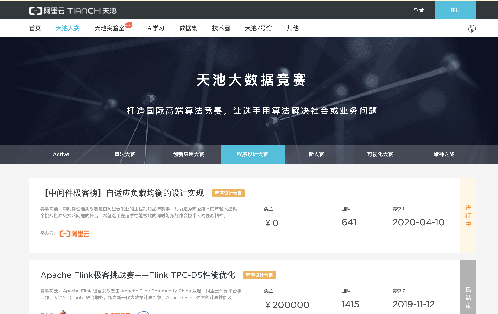
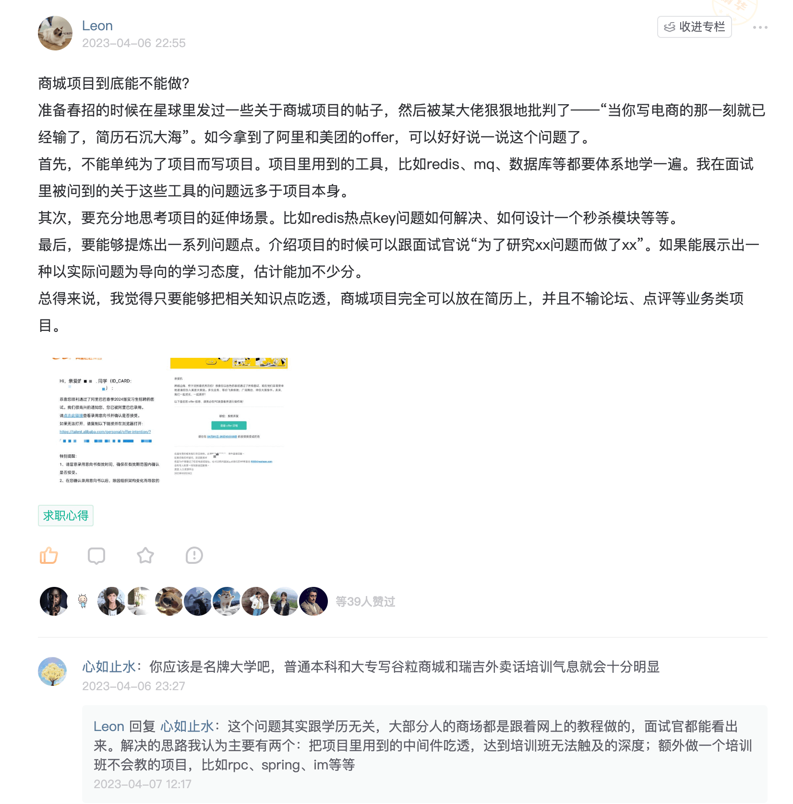
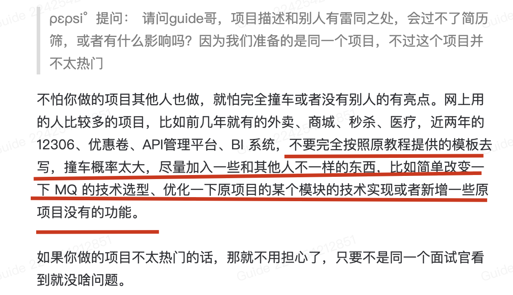

# 什么样的项目是面试官认为有价值的？

最有价值的当然是你参加各种大公司组织的各种大赛（比如阿里的天池软件设计大赛）而做的项目，如果参加这种赛事能获奖的话，项目含金量非常高。即使没获奖也没啥，也可以写简历上。

跟着老师或者普通公司做的项目的话，一般都是面向企业级别，一般很少会用到一些比较有亮点的技术，基本都是一些 CRUD 业务开发。这种项目的含金量稍低，即使你的业务很复杂。遇到这种情况可以考虑说自己去对项目进行改进，别怕花时间，某个时间用心做好一件事情就好比如你对项目的数据模型进行改进、引入缓存提高访问速度等等。详细优化方法请参考：[https://t.zsxq.com/0eV4BksDb](https://t.zsxq.com/0eV4BksDb) 。

如果实习期间能接触到一个不错的项目，并且自己能完成一些简单任务的话也是很不错的。至于你在简历中如何描述个人职责，我个人觉得只要你搞懂吃透的功能点你都可以写。我们只是迫于压力，为了找工作而简单润色一下项目经历而已嘛！不然的话，大概率应该也没啥可写的，毕竟实习期间通常只会让你做一些简单的工作。注意随机应变即可，适当润色完全没问题的。关于实习经历在简历上一般怎么写比较出彩，可以参考《Java面试指北》中的这篇文章里面有详细提到：

[⭐Java面试准备常见问题解答（补充）](https://www.yuque.com/snailclimb/mf2z3k/yf7r73e7z98gyu71)

你还要保证自己的项目的不是烂大街那种（比如商城系统、博客系统、外卖系统、人力资源管理系统、医院挂号系统），尽量和别人避开，别网上流传一个项目，然后自己名字不改，啥也不做就写简历上了。但并不是烂大街的项目就一定会被 PASS 掉，这些项目在不同的求职者手里，展示在简历上的内容和面试回答的效果是参差不齐的。拿电商项目来说，依然有挺多小伙伴用电商项目敲开了大厂的大门。建议你认真看一下这位球友的分享：[https://t.zsxq.com/11BcCNhbB](https://t.zsxq.com/11BcCNhbB) 。

Gitee 上的 [**Java 项目 Hub**](https://gitee.com/itxinfei/hub) （这个仓库已经被举报关闭了）这个仓库总结了培训机构中常见的一些教学实战类项目，面试中用的人比较多。如果你的项目也是其中这些的话，记得一定要改一下名字，添加一些有特色的亮点。

如果你的项目属于上面列举的那种用的人比较多的类型，想要写这个项目在简历上的话，修改一个比较像真实项目的名字是必需的。另外，你需要加入一些和其他人不一样的东西，比如简单改变一下 MQ 的技术选型、优化一下原项目的某个模块的技术实现。如果完全按照原教程来写的话，很容易和别人撞车（如果已经优化过的话，可以忽略这条建议）。

除此之外，你还可以将这些烂大街的项目包装成其他业务类型的项目。基本原则就是：基本不改变技术实现，但对项目的业务类型进行改变。这也是很多同学用到的一个方法，还挺有效的。

另外， 项目已经上线或者你已经部署到服务器的话，那也是加分点。

> 更新: 2025-01-01 15:50:01  
> 原文: <https://www.yuque.com/snailclimb/mf2z3k/sw3btw4x1cmwxg6u>