# 优质 Java 实战项目推荐

这篇文章中，我推荐的 Java 实战项目分为下面几类：

1. **非轮子类开源项目和轮子类开源项目**：比较适合有编程基础的同学，大部分实战开源项目是没有详细的教程可以参考的。
2. **国外公开课 Lab**：一般都是轮子类项目，偏底层，如果你已经有一个业务类实战项目的话，可以考虑。如果你没有业务类型实战项目的话，建议你先把精力放在业务类项目上。
3. **视频类实战项目教程**：免费的通常用的人比较多，更容易烂大街。付费的一般要更好一些，如果经济条件允许的话，还是值得考虑的。视频教程比较适合编程基础稍差，或者想要完整地跟着视频教程走完一整个项目的同学。

像实时聊天系统、撮合交易系统、文件/网盘管理系统、在线视频系统、优惠卷系统、AI 问答系统、网关系统、分布式存储系统等等都不是不错的方向。

除了推荐的这些项目之外，知识星球里分享了网盘项目、RPC 项目（附带教程）。并且，已经更新了博客/论坛项目、校园订餐/外卖系统等“烂大街”项目的介绍模板和优化思路（正在持续补充）。传送门：[星球项目资料合集（持续更新中）](https://t.zsxq.com/Xlozm)。

## 非轮子类开源项目

### 在线考试系统

[uexam](https://gitee.com/mindskip/uexam) 一款前后端分离的在线考试系统。这款在线考试系统，不光支持 web 端，同时还支持微信小程序端。界面设计美观，代码整体结构清晰，表设计比较规范。

我在 2020 和 2021 年的时候，曾经写过两篇文章来推荐这个项目：

+ [好一个 Spring Boot 开源在线考试系统！解决了我的燃眉之急](https://mp.weixin.qq.com/s/L7HudRql5IO6rwyI0YeXdA)
+ [30 张图！手把手带你盘 Spring Boot 前后端分离实战项目！](https://mp.weixin.qq.com/s/XnLj45P3_CmN7SixHBGJ-g)

**技术栈** ：

+ 后端： Spring Boot +MySQL/PostgreSQL+Redis+MyBatis+七牛云存储
+ 前端 ：Vue+ Element UI+Echarts+Ueditor

**相关地址** ：

+ Gitee 地址：[https://gitee.com/mindskip/uexam](https://gitee.com/mindskip/uexam)
+ 在线演示：[https://www.mindskip.net/xzs.html](https://www.mindskip.net/xzs.html)
+ 数据库脚本下载地址：[https://www.mindskip.net:888](https://www.mindskip.net:888)
+ 官方文档：[https://www.mindskip.net:888](https://www.mindskip.net:888)
+ 视频教程：[https://ke.qq.com/course/3614230](https://ke.qq.com/course/3614230)

学生考试系统：

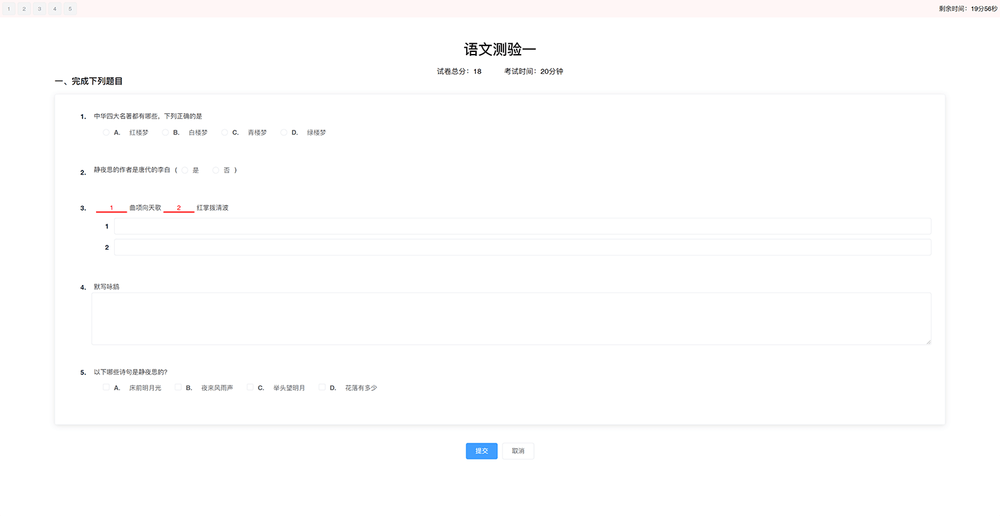

小程序端：

类似的考试/刷题系统，可以参考我的网站上的总结：[https://javaguide.cn/open-source-project/practical-project.html](https://javaguide.cn/open-source-project/practical-project.html) 。

  
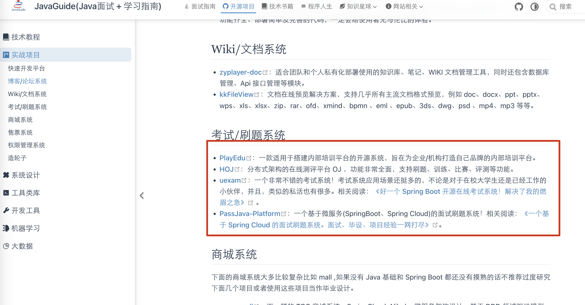

### 
### 个人网盘

[zfile](https://github.com/zfile-dev/zfile)是一个于 Java 的在线网盘程序，支持对接 S3、OneDrive、SharePoint、Google Drive、多吉云、又拍云、本地存储、FTP、SFTP 等存储源，支持在线浏览图片、播放音视频，文本文件、Office、obj（3d）等文件类型。

**技术栈** ：

+ 后端：Spring Boot + Spring Security + Mybatis Plus + Flyway+ [Sa-Token](https://sa-token.cc/)+Hutool+[MapStruct ](https://mapstruct.org/)
+ 前端 ： Vue3+Pinia+VueRoute+Axios+Element Plus

**相关地址** ：

+ Github 地址：后端：[https://github.com/zfile-dev/zfile](https://github.com/zfile-dev/zfile)，前端：[https://github.com/zfile-dev/zfile-vue](https://github.com/zfile-dev/zfile-vue)
+ 官方网站：[https://www.zfile.vip/](https://www.zfile.vip/)
+ 官方文档：[https://docs.zfile.vip/](https://docs.zfile.vip/)
+ 在线演示：[https://demo.zfile.vip](https://demo.zfile.vip/)

前台：

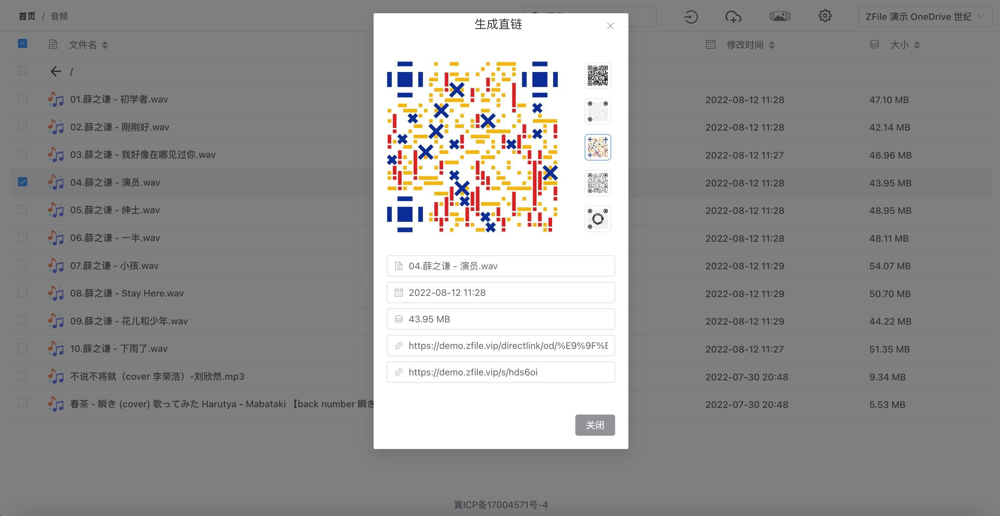

后台：

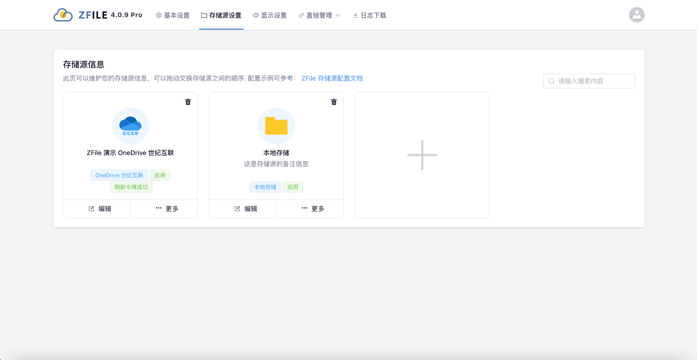

类似的项目还有很多，比如：

+ [qiwen-file](https://gitee.com/qiwen-cloud/qiwen-file) ：基于 SpringBoot+Vue 实现的分布式文件系统，支持本地磁盘、阿里云 OSS 对象存储、FastDFS 存储、MinIO 存储等多种存储方式，支持 office 在线编辑、分片上传、技术秒传、断点续传等功能。
+ [free-fs](https://gitee.com/dh_free/free-fs) ：基于 SpringBoot + MyBatis Plus + MySQL + Sa-Token + Layui 等搭配七牛云， 阿里云OSS实现的云存储管理系统。

### 社区系统

[**upupor**](https://t.zsxq.com/zb2fMzr) 是一个小众但是功能强大，代码质量也还可以的开源社区，挺适合作为学习的项目。 最主要的是这个项目目前知名度非常非常低，没有项目经历的小伙伴也可以改造升级一下拿来作为自己的项目经历。

**技术栈** ：

+ 后端：Spring Boot + MySQL + Redis + Undertow（Web 容器）
+ 前端 ：Thymeleaf（模板引擎，方便 SEO）+ Bootstrap

**相关地址** ：

+ Github 地址：[https://github.com/yangrunkang/upupor](https://github.com/yangrunkang/upupor) 。
+ 在线演示：[https://upupor.com](https://upupor.com/) （该网站目前已经暂时停止维护了）。

网站的性能也是不错的：

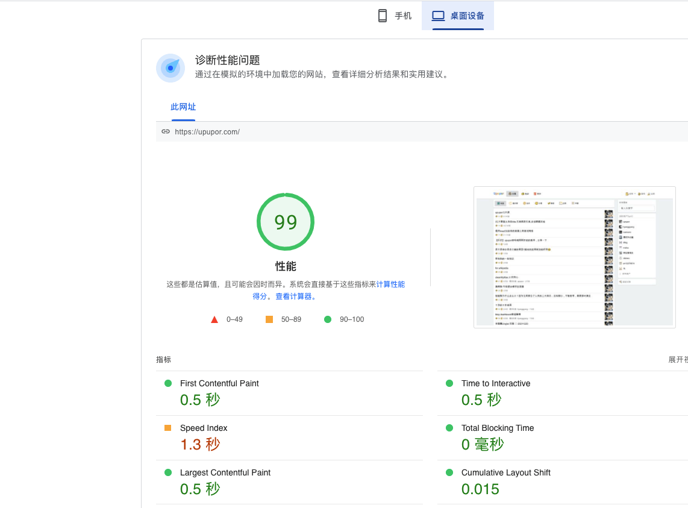

类似的社区类小众但有两点的项目还有 [forest](https://github.com/rymcu/forest)。

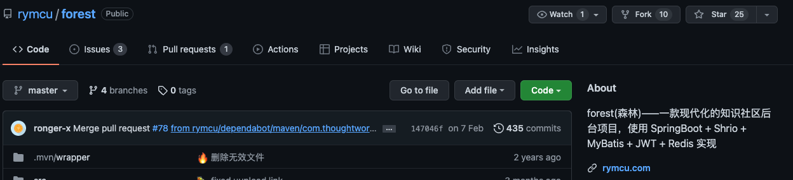

不同于其他社区项目，forest 这个知识社区项目主打文章分享，可以自定义专题和作品集。看得出来作者维护比较认真，并且很有想法。根据项目首页介绍，这个项目未来还可能会增加专业知识题库、社区贡献系统、会员系统。

我大概浏览了一下这个项目代码，发现这个项目的代码写的也相对比较规范干净，比很多 star 数量比较多的社区类项目都要好太多！

**技术栈** ：

+ 后端： SpringBoot + Shrio + MyBatis + JWT + Redis
+ 前端：Vue + NuxtJS + Element-UI。

**相关地址** ：

+ Github 地址：[https://github.com/rymcu](https://github.com/rymcu) 。
+ 在线演示：[https://rymcu.com/](https://rymcu.com/) 。

### 小说网站

[**novel-plus**](https://t.zsxq.com/iufIi2R) 是一个开源的小说网站项目。这个项目的代码质量也是非常不错的，结果清晰，代码结构也比较规范。这是我推荐这个项目很大的一个原因。

+ Github 地址：[https://github.com/201206030/novel-plus](https://github.com/201206030/novel-plus)
+ Gitee 地址：[https://gitee.com/novel_dev_team/novel-plus](https://gitee.com/novel_dev_team/novel-plus)

另外，除了单体版之外，这个项目还有一个基于 Spring Cloud 的微服务版本供你学习使用。

+ GitHub 地址： [https://github.com/201206030/novel-cloud](https://github.com/201206030/novel-cloud)
+ Gitee 地址： [https://gitee.com/novel_dev_team/novel-cloud](https://gitee.com/novel_dev_team/novel-cloud)

技术栈：

+ 后端： SpringBoot + MyBatis +Spring Security + Elasticsearch+ 支付宝支付
+ 前端：Thymeleaf + Layui。

  

这个项目还有一个爬虫模块用于系统初期测试使用。对 Java 爬虫感兴趣的朋友，可以简单研究一下。

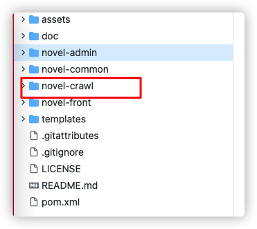

### 在线文档管理

[**document-sharing-site**](https://github.com/Jarrettluo/document-sharing-site) 是一个支持几乎所有类型（Word, Excel, PPT, PDF, Pic 等）的文档存储、在线预览、共享的开源项目。

**技术栈** ：

+ 后端：Spring Boot + Hutool + Tika(内容分析工具包) + Elasticsearch + JWT
+ 前端：Vue + axios。

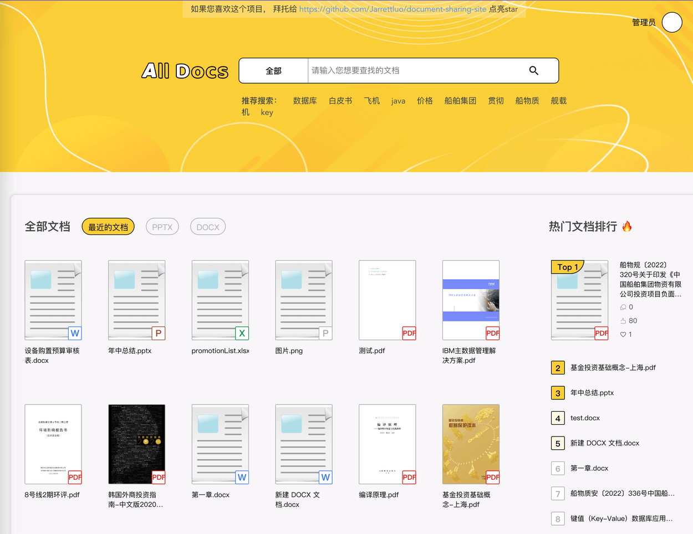

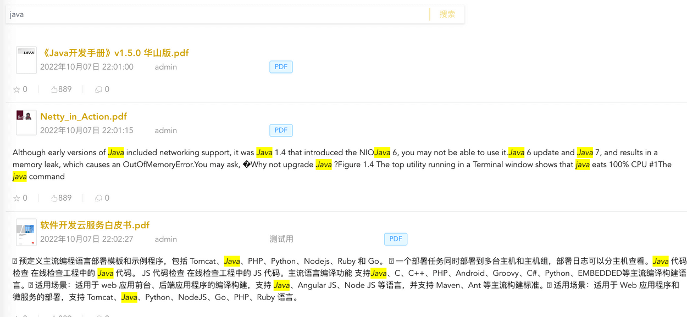

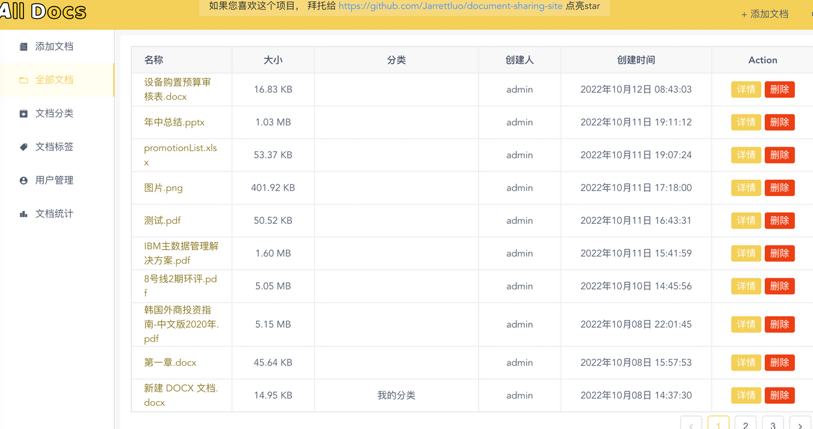

**相关地址** ：

+ 项目地址：[https://github.com/Jarrettluo/document-sharing-site](https://github.com/Jarrettluo/document-sharing-site)
+ 在线体验：[http://81.69.247.172/#/](http://81.69.247.172/#/)

### 导航网站

[**geshanzsq-nav**](https://t.zsxq.com/FEYBYbU) 是一个前后端分离的导航网站。这个项目同样非常小众，撞车的概率非常小，并且，质量也是非常高。

**技术栈** ：

+ 后端： SpringBoot + MyBatis Plus + Spring Security + JWT + MySQL + Redis
+ 前端：Vue3 + Element Plus

**相关地址** ：

+ Github 地址：[https://github.com/geshanzsq/geshanzsq-nav](https://github.com/geshanzsq/geshanzsq-nav)
+ Gitee 地址 ：[https://gitee.com/geshanzsq/geshanzsq-nav](https://gitee.com/geshanzsq/geshanzsq-nav)
+ 在线演示：[https://gesdh.cn/](https://gesdh.cn/) 。

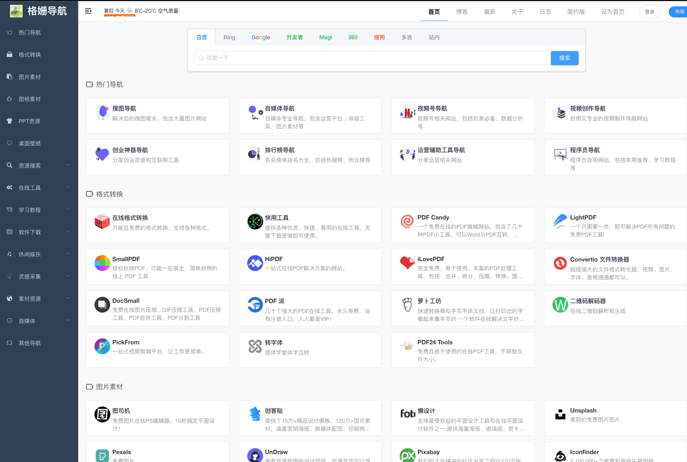

## 轮子类开源项目

轮子类项目尽量不要超过一个，面试还是以问业务项目为主的！

### 消息队列

消息队列有两个开源项目可供选择。

1、[mq](https://github.com/houbb/mq) 一个简易版消息中间件实现，功能比较简单，不支持顺序、事务、延时等功能。

Github 地址：[https://github.com/houbb/mq](https://github.com/houbb/mq) 。

2、[folkmq](https://gitee.com/noear/folkmq) 是一个最简单的消息中间件（单机可达 180K TPS），支持顺序、事务、延时、过期、请求等消息特性。相比于 [mq](https://github.com/houbb/mq) 来说，[folkmq](https://gitee.com/noear/folkmq) 的功能要更完善一些。并且，folkmq 附带完整的开发过程视频，比较适合学习。

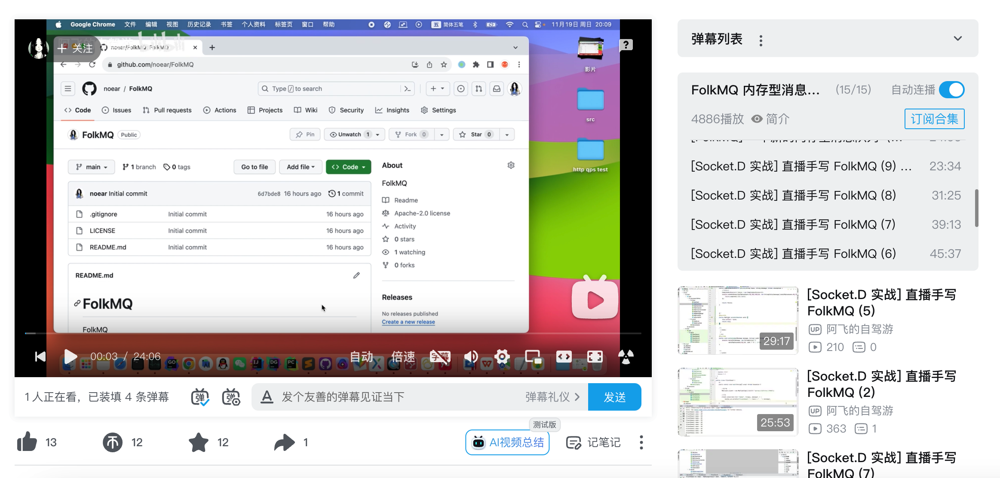

Gitee 地址：[https://gitee.com/noear/folkmq](https://gitee.com/noear/folkmq) 。

### 本地缓存

[**cache**](https://t.zsxq.com/RfyRrrv) 是一个不错的轮子类项目，使用 Java 手写一个类似于 Redis 的单机版本地缓存(附详细教程)。 麻雀虽小五张俱全，支持数据缓存、缓存失效时间、数据淘汰策略（如 FIFO 、 LRU ）、RDB 和 AOF 持久化......。 并且，这个项目附带了 6 篇教程来讲解核心功能具体是怎么实现的。

Github 地址：[https://github.com/houbb/cache](https://github.com/houbb/cache)

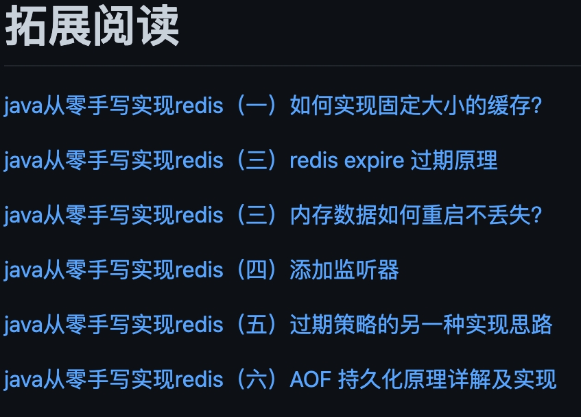

### RPC 框架

> 这个项目现在用的人比较多了，如果要写在简历上的话，建议修改部分技术实现比如换一个注册中心。
>

guide-rpc-framework 是一款基于 Netty+Kyro+Zookeeper 实现的 RPC 框架。

+ Github 地址: [https://github.com/Snailclimb/guide-rpc-framework](https://github.com/Snailclimb/guide-rpc-framework)
+ Gitee 地址 ：[https://gitee.com/SnailClimb/guide-rpc-framework](https://gitee.com/SnailClimb/guide-rpc-framework)

这个项目代码注释详细，结构清晰，并且集成了 Check Style 规范代码结构，非常适合阅读和学习。

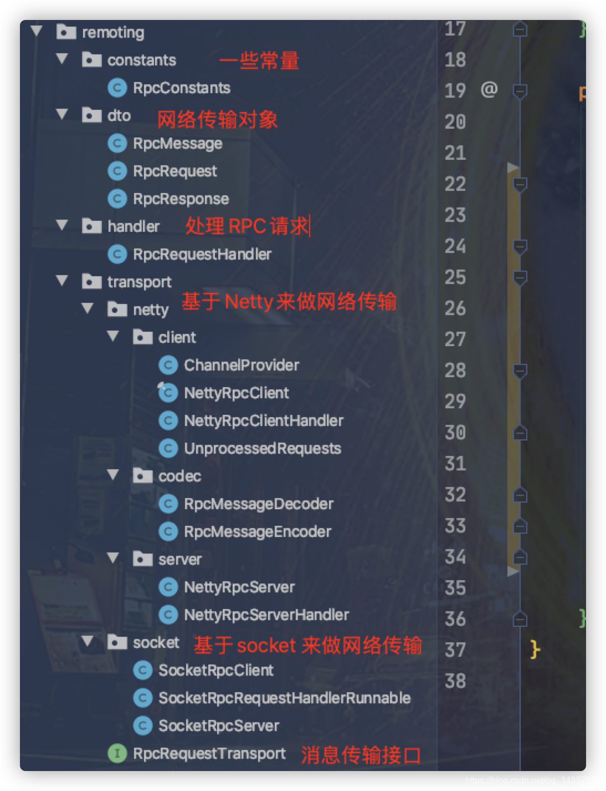

并且，这个项目的 README 文档写的也非常认真。从 README 文档中，你就可以大概了解到这个 RPC 框架的设计思路以及前置技术。

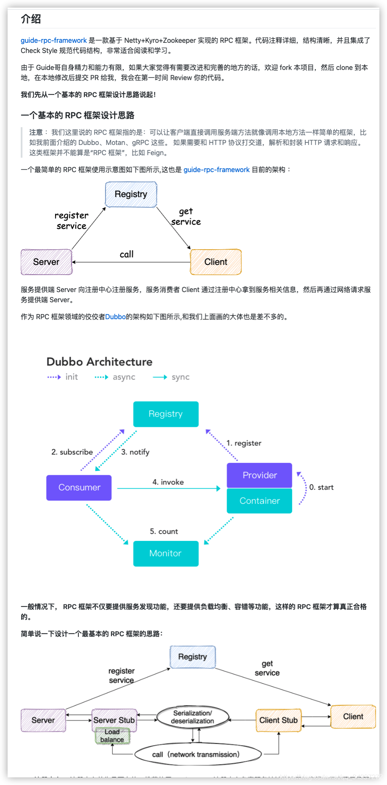

### 数据库

MYDB 是一个 Java 语言实现的简易版数据库，部分原理参照自 MySQL、PostgreSQL 和 SQLite。

麻雀虽小，五脏俱全。MYDB 目前已经实现 MVCC、两种事务隔离级别（读提交和可重复读）、死锁处理、简陋的 SQL 解析等关系型数据库的核心功能。

并且，MYDB 作者写了详细的实现教程，教程地址： [https://ziyang.moe/cs/project/mydb/](https://ziyang.moe/cs/project/mydb/)

Github 地址：[https://github.com/CN-GuoZiyang/MYDB](https://github.com/CN-GuoZiyang/MYDB)

### 编译器

Mini-Compiler 是一个 Mini 版本的入门级编译器，基于 Java 语言编写，有助于初学者了解面向对象编程语言编译器的运行原理。

代码示例：

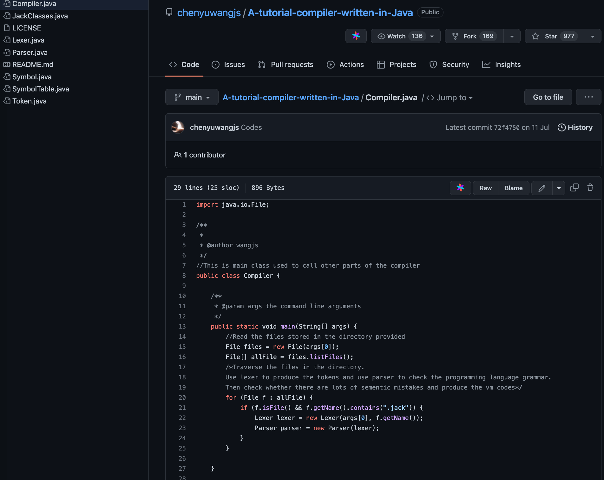

可以看到，代码注释还是非常清晰的，一共只有 7 个类。

不过，想要搞懂这个项目难度会远大于普通的业务类型项目，像核心类 `Parser` （语法解析器）的代码量接近有 2000 行（其它 6 个类代码量比较少）。

Github 地址：[https://github.com/chenyuwangjs/A-tutorial-compiler-written-in-Java](https://github.com/chenyuwangjs/A-tutorial-compiler-written-in-Java) 。

下面是一些相关的学习资料 ：

+ [写给小白的开源编译器](https://www.cnblogs.com/xueweihan/p/16283249.html)
+ [700 行手写编译器（视频）](https://www.bilibili.com/video/BV1Kf4y1V783/)
+ [《编译器设计》](https://book.douban.com/subject/20436488/)

## 国外公开课 Lab

### 手写关系型数据库

MIT 6.830/6.814: Database Systems 这门课程的内容非常适合想要深入学习数据库原理的小伙伴。这门课程的 lab 是使用 Java 语言一步一步实现一个关系型数据库。

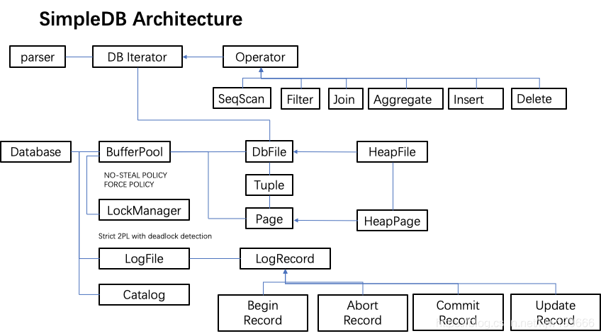

+ 课程地址：[http://db.lcs.mit.edu/6.830/](http://db.lcs.mit.edu/6.830/) 。
+ 课程代码：[https://github.com/MIT-DB-Class/simple-db-hw](https://github.com/MIT-DB-Class/simple-db-hw) 。
+ 课程讲义：[https://github.com/MIT-DB-Class/course-info-2018/](https://github.com/MIT-DB-Class/course-info-2018/) 。
+ 课程视频：[https://www.youtube.com/playlist?list=PLfciLKR3SgqOxCy1TIXXyfTqKzX2enDjK](https://www.youtube.com/playlist?list=PLfciLKR3SgqOxCy1TIXXyfTqKzX2enDjK) 。

网络上有一些相关的文章分享：

+ [https://blog.csdn.net/hjw199666/category_9588041.html](https://blog.csdn.net/hjw199666/category_9588041.html)
+ [https://zhuanlan.zhihu.com/p/58595037](https://zhuanlan.zhihu.com/p/58595037)

另外，UCB CS186: Introduction to Database System 的这门课程 lab 也是使用 Java 实现一个关系型数据库。

+ 课程地址：[https://cs186berkeley.net/sp21/](https://cs186berkeley.net/sp21/) 。
+ 课程视频：[https://www.bilibili.com/video/BV13a411c7Qo](https://www.bilibili.com/video/BV13a411c7Qo) 。

### 手写分布式 KV 存储

MIT6.824: Distributed System 这门课程出品自 MIT 大名鼎鼎的 PDOS 实验室，授课老师 Robert Morris 教授。Robert Morris 曾是一位顶尖黑客，世界上第一个蠕虫病毒 Morris 病毒就是出自他之手。

这门课程的 lab 会循序渐进带你实现一个基于 Raft 共识算法的 KV-store 框架，让你在痛苦的 debug 中体会并行与分布式带来的随机性和复杂性。

+ 课程网站：[https://pdos.csail.mit.edu/6.824/schedule.html](https://pdos.csail.mit.edu/6.824/schedule.html) 。
+ 课程视频（中文翻译）：[https://www.bilibili.com/video/BV1R7411t71W](https://www.bilibili.com/video/BV1R7411t71W) 。

相关资料：

+ MIT6.824: Distributed System（中文翻译 wiki）： [https://mit-public-courses-cn-translatio.gitbook.io/mit6-824/](https://mit-public-courses-cn-translatio.gitbook.io/mit6-824/)
+ 如何的才能更好地学习 MIT6.824 分布式系统课程？：[https://www.zhihu.com/question/29597104](https://www.zhihu.com/question/29597104)
+ 我是如何做基于 Raft 的分布式 K-V 数据库的？：[https://t.zsxq.com/0erQPlUzA](https://t.zsxq.com/0erQPlUzA) （一位球友的分享）

## 视频类实战项目教程

### 免费

+ [尚庭公寓](https://t.zsxq.com/XM5fn) ：尚庭公寓项目是尚硅谷研发的一款公寓租赁平台。项目覆盖完整的开发流程，逻辑清晰，设计精妙，带你从零开始，从设计（数据库设计、接口设计）到开发，再到部署。
+ [基于 COLA 架构的抽奖系统](https://www.j3code.cn/myFile/static/resources/document/bld/bld_sys.html)（视频教程地址：[https://www.bilibili.com/video/BV1284y1r7en/](https://www.bilibili.com/video/BV1284y1r7en/)）：一个基于 COLA 架构的抽奖系统，基于 JDK11 + SpringBoot2.5 。
+ [在线教育系统 & 预约挂号系统 & 办公系统 & 众筹系统 & 云原生实战](https://t.zsxq.com/zFIAubi)（尚硅谷的实战项目全家桶，项目还不错，就是用的人太多，更适合作为学习项目。当然了，你也可以对原项目进行润色改进包装）

### 付费

首先声明下面这些付费课程，我都没有实际购买，选择因素主要关注的是下面几点：

+ 项目是否已经烂大街了？是否可以写在简历上？
+ 项目的技术栈是否主流？是否能让自己真正学到东西？
+ 项目是否容易挖掘亮点？

其次这些付费课程和我并无利益关系，对于学生来说部分课程的价格还是比较贵的。

最后一定一定一定不要冲动消费，可以先找一些免费的资源看看，避免浪费钱。

1. [Lottery 抽奖系统 - 基于领域驱动设计的四层架构实践](https://bugstack.cn/md/project/lottery/introduce/Lottery%E6%8A%BD%E5%A5%96%E7%B3%BB%E7%BB%9F.html)（推荐）：从零带你开发一个分布式抽奖系统。
2. [大营销平台系统（推荐）](https://bugstack.cn/md/project/big-market/big-market.html)：采用新的 DDD 架构，对 Logttery 抽奖系统进行重构，并扩展出营销账户、用户返利、积分兑换等服务，完成一整套的营销平台功能。
3. [OpenAi 大模型应用体系构建 - API-SDK、鉴权、公众号、微信支付](https://bugstack.cn/md/zsxq/project/chatgpt.html)（推荐）：以应用 OpenAI 技术，对接多种大模型提供生成式服务，采用微服务架构。
4. [SpringBoot Starter 中间件设计和开发](https://bugstack.cn/md/zsxq/project/springboot-starter.html)：16个中间件的设计和开发，例如限流组件、超时熔断组件、ORM 框架、RPC 框架、分布式任务调度、IDEA 插件。
5. [Netty+Nacos+Disruptor 自研企业级 API 网关](https://coding.imooc.com/class/655.html)：从 0 到 1 手把手带你构建完整的企业级网关。
6. [Spring Cloud+Vertx+Disruptor 撮合交易系统实战](https://coding.imooc.com/class/437.html) ：从无到有开发一个高可用低延时的撮合交易系统。
7. [SpringBoot+Vue3+Element Plus 打造分布式存储系统](https://coding.imooc.com/class/632.html)：从 0 到 1 全流程打造商业级分布式数据存储系统。
8. [基于 JDK17 + SpringBoot3 + SpringCloud 微服务架构的高并发短链系统](https://gitee.com/nageoffer/12306)： SaaS 短链接系统，承载高并发和海量存储等场景难题。

前 4 个项目都是我的好朋友小傅哥星球里的项目，质量非常高，非常推荐！除了这 4 个项目之外，还有仿桌面版微信、API 网关等共计 8 个项目，介绍地址：[https://gaga.plus/](https://gaga.plus/)。小傅哥专门给咱们星球的朋友提供了一个 30 元的专属优惠卷，需要实战项目的球友可以考虑加入一波！

## 最后

一定一定要看一下《Java面试指北》的下面这两篇文章：

[什么样的项目是面试官认为有价值的？](https://www.yuque.com/snailclimb/mf2z3k/sw3btw4x1cmwxg6u)

[⭐项目经验常见问题解答（补充）](https://www.yuque.com/snailclimb/mf2z3k/redsrr)

有助于你选择到更合适写在简历上的项目，并且，里面有提到烂大街项目的基本优化套路。

> 更新: 2025-01-19 21:35:50  
> 原文: <https://www.yuque.com/snailclimb/mf2z3k/sq5pg4>