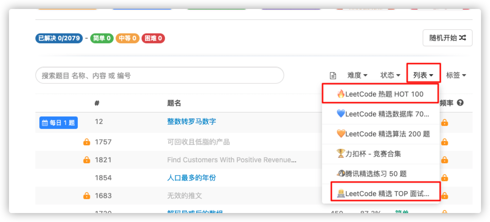
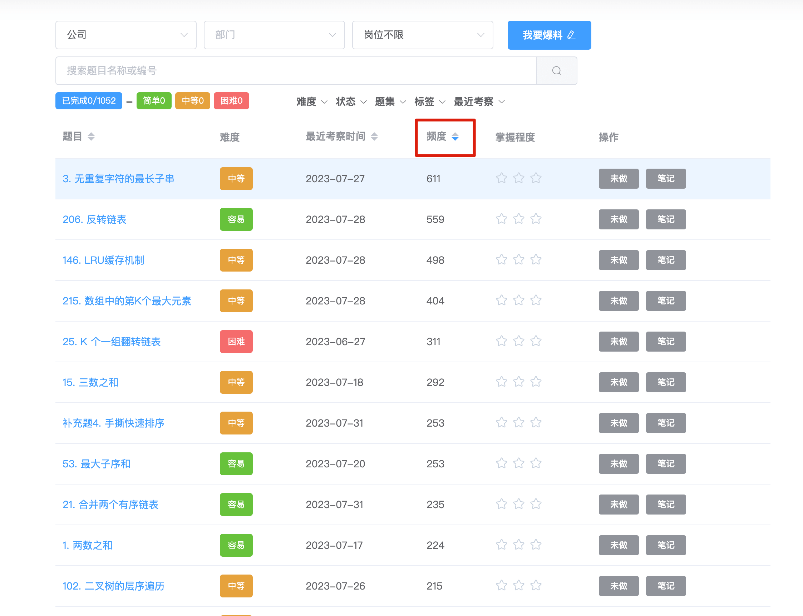
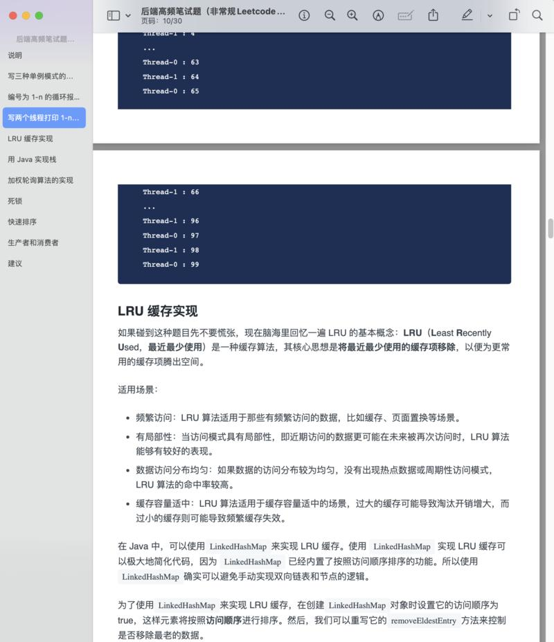

# 如何高效准备算法面试？

## 为什么要准备算法面试？

很明显，国内现在的校招面试开始越来越重视算法了，尤其是像字节跳动、腾讯这类大公司。绝大部分公司的校招笔试是有算法题的，如果 AC 率比较低的话，基本就挂掉了。

社招的话，算法面试同样会有。不过，面试官可能会更看重你的工程能力，你的项目经历。如果你的其他方面都很优秀，但是算法很菜的话，不一定会挂掉。不过，还是建议刷下算法题，避免让其成为自己在面试中的短板。

社招往往是在技术面试的最后，面试官给你一个算法题目让你做。

为了能够应对，我们大部分人能做的就是刷 Leetcode 来积累做算法题的经验和套路。

另外， 很多小伙伴特别是已经工作几年的，总觉得说算法这东西没啥用。确实，相比于系统设计能力，工程能力来说，算法对于普通工程师的价值可能并不是那么大。但是，在面试中算法确实很能考验面试者能力的一个环节。单纯靠项目经历以及技术面试的话，还是很容易弄虚作假的。算法能力在某些角度可以反映你解决编程问题的能力以及你的思维能力。

## 刷 LeetCode 吃力正常吗？

我想说的是太正常不过了！我的工程能力在同龄人中应该还算可以，但是很多 Leetcode 上面的算法题我真做不出来。手撕算法方面我真的没有公司新招进来的应届生强。说实话，公司出的算法题，我自己都不一定能做出来（主要是因为工作之后很久没碰了）。

小声 BB：应届生过来了还是要不断经历我们“老人“的 diss，哈哈哈！鲁迅先生说：没有 diss,哪里来的成长。

## 刷 Leetcode 需要哪些基础？

### 编程语言

刷题之前，确保你有一个还算熟悉的编程语言。比较常用的有 Java、C/C++、Python、Go。

### 数据结构和算法基础

为了让自己更愉快地刷题，一些基本的数据结构和算法知识是必备的。

刷 Leetcode 之前，如果你还没有算法和数据结构方面的基础知识的话，可以先看一些比较适合入门的书籍。我的下面这个回答会推荐一些算法相关的书籍和学习资源（写的用心，觉得不错的话可以点个赞鼓励一下）：[《有哪些值得推荐的好的算法书？》](https://www.zhihu.com/question/323359308/answer/1545320858) 。

+ 数据结构：数组、链表、栈、队列、堆、二叉树、图、哈希表、并查集
+ 算法思想 ： 递归、动态规划、二分查找、贪心、分治、回溯、DFS、BFS、KMP、树的广度和深度优先搜索、
+ 数学： 位运算、质数、排列组合

另外，对于每一种编程语言都有一些内置的常用数据结构的实现，我们需要提前了解。拿 Java 来说，`HashMap`、`TreeMap`，`TreeSet`，`PriorityQueue`，`Deque` 等都是比较常用的。

## 要刷多少题目？

建议每个类型的题目至少要刷 10~15 道(动态规划, 多多益善，考试很常见)。总共加起来，大概至少需要刷 200~300 道。

不过，也不要一味追求数量，要搞懂吃透，能举一反三就更好了，这样算法面试就更保险了！要多总结和多回顾，总结不同类型题目的解题思路，回顾自己过往做过的错题和难题。

## 怎么高效刷 Leetcode？

最重要的还是一定要坚持刷起来！！！

### 按照类型来刷

我个人比较建议每次刷题主攻一个类型，比如你某一天或者几天就主要刷动态规划相关的题目。

**为什么这样建议呢？** 也是一点个人经验吧！我当时在刷算法题的时候，发现如果每次做的算法题类型跨度太大的话，非常影响自己速度和体验。当你刷了同一种类型的题目比较多了之后，你就会大概知道这类题型的套路了。

**不建议刷的题目类型**：

+ 非高频的hard题目，费时费力又很难在面试中遇到，性价比太低。
+ 贪心法题目，每道题都不一样，解法没有通用性。

### 由简入难

很多朋友可能和我一样，刚开始刷 LeetCode 的时候，寸步难行，经常一道算法题一下午写不出来。当时，我甚至开始怀疑自己是不是笨。为此，我专门找到一些算法大佬交流。算法大佬安慰我说：“ 不是你笨，不用灰心！你先从简单地算法题开始做起，多多总结就好了！”。

于是，我每天抽出 1~3 个小时专门用来刷简单类型的算法题。刷了一个多月之后，一些我比较熟悉的题型（简单类型）可以不看答案就能直接 AC 了。

刷算法是一个循序渐进的过程，如果你不是 ACM 大佬这种级别的人物的话，还是建议先从简单开始刷起，慢慢积累经验。

不过，要说明的一点是：很多简单类型的题目甚至还要比中等类型的题目还要难！所以，如果你没办法解决一些简单的算法题，也不要太纠结，不要因此失去信心。

### 重视高频面试题目/题型

如果你的时间不是很充足的话，建议可以从高频面试题入手。

像 Leetcode 上面就专门把一些最热门的算法面试题给单独整理了出来。

你还可以参考一下 [CodeTop 企业题库](https://codetop.cc/home) 这个网站上的高频算法题。

另外，下面这些算法专题都挺值得刷一遍的(有重复)：

+ 《剑指 Offer（专项突击版）》: [https://doocs.github.io/leetcode/#/lcof2/README](https://doocs.github.io/leetcode/#/lcof2/README)
+ 《程序员面试金典（第 6 版）》: [https://doocs.github.io/leetcode/#/lcci/README](https://doocs.github.io/leetcode/#/lcci/README)
+ Leetcode 面试经典 150 题：[https://leetcode.cn/studyplan/top-interview-150/](https://leetcode.cn/studyplan/top-interview-150/) 。
+ Leetcode 的 100 道高频算法题：[https://leetcode.cn/studyplan/top-100-liked/](https://leetcode.cn/studyplan/top-100-liked/) 。
+ 牛客网面试高频 202：[https://www.nowcoder.com/exam/oj?page=1&tab=算法篇&topicId=354](https://www.nowcoder.com/exam/oj?page=1&tab=%E7%AE%97%E6%B3%95%E7%AF%87&topicId=354)

## 面试中有哪些常见的手撕代码题？

我总结了一些常见的非常规 Leetcode 类型的高频笔试题，每一道题目都有详细的解答。

目前共有下面这些问题详细的解答（后续会在知识星球里持续同步更新完善）：

1. 写三种单例模式的实现方式
2. 编号为 1-n 的循环报 1-3，报道 3 的出列，求最后一人的编号
3. 写两个线程打印 1-n，一个线程打印奇数，一个线程打印偶数
4. LRU 缓存实现
5. 用 Java 实现栈
6. 加权轮询算法的实现
7. 死锁
8. 快速排序
9. 生产者和消费者

前三道就是 2024 届的阿里淘天笔试题，参考这篇面经：[阿里淘天一面，秒挂！](https://mp.weixin.qq.com/s/DLHpyEXTHHotxEYZd8P0KQ)。

「后端高频笔试题（非常规Leetcode类型）PDF」 下载地址：[https://t.zsxq.com/12XJ0SfTN](https://t.zsxq.com/12XJ0SfTN) （代码不太方便复制，建议参考着答案自己手敲一遍。另外，很多题的解法都有挺多种，记得选择自己比较熟悉且合理的）。

> 更新: 2024-02-29 22:39:12  
> 原文: <https://www.yuque.com/snailclimb/mf2z3k/guu8a1>