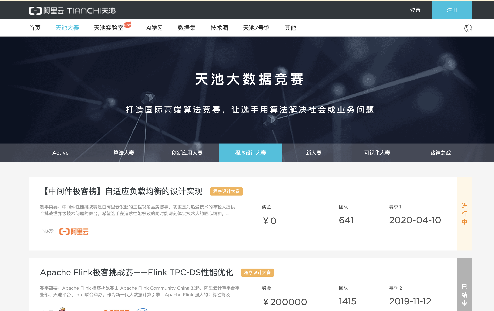
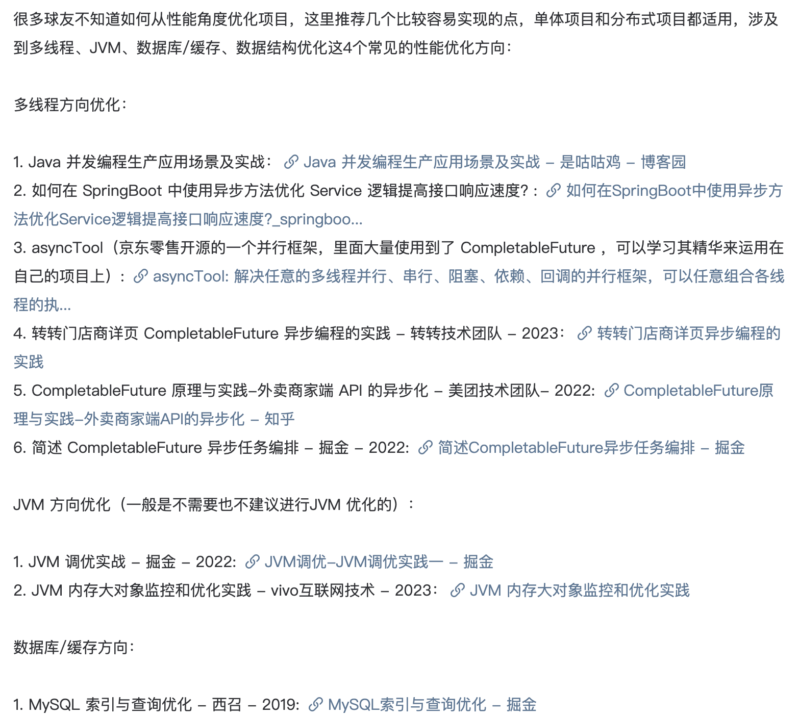

# 没有项目经验怎么办？

## 没有项目经验怎么办?

没有项目经验是大部分应届生会碰到的一个问题。甚至说，有很多有工作经验的程序员，对自己在公司做的项目不满意，也想找一个比较有技术含量的项目来做。

说几种我觉得比较靠谱的获取项目经验的方式，希望能够对你有启发。

### 实战项目视频/专栏

在网上找一个符合自己能力与找工作需求的实战项目视频或者专栏，跟着教程一起做。

你可以通过慕课网、哔哩哔哩、拉勾、极客时间、培训机构（比如黑马、尚硅谷）等渠道获取到适合自己的实战项目视频/专栏。

尽量选择一个适合自己的项目，没必要必须做分布式/微服务项目，对于绝大部分同学来说，能把一个单机项目做好就已经很不错了。

我面试过很多求职者，简历上看着有微服务的项目经验，结果随便问两个问题就知道根本不是自己做的或者说做的时候压根没认真思考。这种情况会给我留下非常不好的印象。

我在《Java 面试指北》的「面试准备篇」中也说过：

> 个人认为也没必要非要去做微服务或者分布式项目，不一定对你面试有利。微服务或者分布式项目涉及的知识点太多，一般人很难吃透。并且，这类项目其实对于校招生来说稍微有一点超标了。即使你做出来，很多面试官也会认为不是你独立完成的。
>
>  
>
> 其实，你能把一个单体项目做到极致也很好，对于个人能力提升不比做微服务或者分布式项目差。如何做到极致？代码质量这里就不提了，更重要的是你要尽量让自己的项目有一些亮点（比如你是如何提升项目性能的、如何解决项目中存在的一个痛点的），项目经历取得的成果尽量要量化一下比如我使用 xxx 技术解决了 xxx 问题，系统 qps 从 xxx 提高到了 xxx。
>

跟着教程做的过程中，你一定要有自己的思考，不要浅尝辄止。对于很多知识点，别人的讲解可能只是满足项目就够了，你自己想多点知识的话，对于重要的知识点就要自己学会去深入学习。另外，不要完全按照原教程来，尤其是那种热门项目（很容易和别人撞车），适当加入一些不一样的东西，比如简单改变一下技术选型、优化一下原项目的某个模块的技术实现。

### 实战类开源项目

Github 或者码云上面有很多实战类别项目，你可以选择一个来研究，为了让自己对这个项目更加理解，在理解原有代码的基础上，你可以对原有项目进行改进或者增加功能。

你可以参考 [Java 优质开源实战项目](https://javaguide.cn/open-source-project/practical-project.html) 上面推荐的实战类开源项目，质量都很高，项目类型也比较全面，涵盖博客/论坛系统、考试/刷题系统、商城系统、权限管理系统、快速开发脚手架以及各种轮子。

一定要记住： **不光要做，还要改进，改善。不论是实战项目视频或者专栏还是实战类开源项目，都一定会有很多可以完善改进的地方。**

### 从头开始做

自己动手去做一个自己想完成的东西，遇到不会的东西就临时去学，现学现卖。

这个要求比较高，我建议你已经有了一个项目经验之后，再采用这个方法。如果你没有做过项目的话，还是老老实实采用上面两个方法比较好。

### 参加各种大公司组织的各种大赛

如果参加这种赛事能获奖的话，项目含金量非常高。即使没获奖也没啥，也可以写简历上。

### 参与实际项目

通常情况下，你有如下途径接触到企业实际项目的开发：

1. 老师接的项目；
2. 自己接的私活；
3. 实习/工作接触到的项目；

老师接的项目和自己接的私活通常都是一些偏业务的项目，很少会涉及到性能优化。这种情况下，你可以考虑对项目进行改进，别怕花时间，某个时间用心做好一件事情就好比如你对项目的数据模型进行改进、引入缓存提高访问速度等等。

实习/工作接触到的项目类似，如果遇到一些偏业务的项目，也是要自己私下对项目进行改进优化。

尽量是真的对项目进行了优化，这本身也是对个人能力的提升。如果你实在是没时间去实践的话，也没关系，吃透这个项目优化手段就好，把一些面试可能会遇到的问题提前准备一下。

## 跟着视频做的项目会被面试官嫌弃不？

很多应届生都是跟着视频做的项目，这个大部分面试官都心知肚明。

不排除确实有些面试官不吃这一套，这个也看人。不过我相信大多数面试官都是能理解的，毕竟你在学校的时候实际上是没有什么获得实际项目经验的途径的。

大部分应届生的项目经验都是自己在网上找的或者买的付费课程跟着做的，极少部分是比较真实的项目。 我觉得初衷是好的，确实也能真正学到东西。 但是，究竟有多少是自己掌握了很重要。看视频最忌讳的是被动接受，自己多改进一下，多思考一下！就算是你跟着视频做的项目，也是可以优化的！

**如果你想真正学到东西的话，建议不光要把项目单纯完成跑起来，还要去自己尝试着优化！**

简单说几个比较容易的优化点：

1. **全局异常处理** ：很多项目这方面都做的不是很好，可以参考我的这篇文章：[《使用枚举简单封装一个优雅的 Spring Boot 全局异常处理！》](https://mp.weixin.qq.com/s/Y4Q4yWRqKG_lw0GLUsY2qw) 来做优化。
2. **项目的技术选型优化** ：比如使用 Guava 做本地缓存的地方可以换成 **Caffeine** 。Caffeine 的各方面的表现要更加好！再比如 Controller 层是否放了太多的业务逻辑。
3. **数据库方面** ：数据库设计可否优化？索引是否使用使用正确？SQL 语句是否可以优化？是否需要进行读写分离？
4. **缓存** ：项目有没有哪些数据是经常被访问的？是否引入缓存来提高响应速度？
5. **安全** ： 项目是否存在安全问题？
6. ......

**常见的性能优化方向实践**（涉及到多线程、JVM、数据库/缓存、数据结构优化这 4 个常见的性能优化方向）总结请看：[https://t.zsxq.com/0c1uS7q2Y](https://t.zsxq.com/0c1uS7q2Y)。

最后，**再给大家推荐一个 IDEA 优化代码的小技巧，超级实用！**

分析你的代码：右键项目-> Analyze->Inspect Code

扫描完成之后，IDEA 会给出一些可能存在的代码坏味道比如命名问题。

并且，你还可以自定义检查规则。

## 什么样的项目是面试官认为有价值的？

[什么样的项目是面试官认为有价值的？](https://www.yuque.com/snailclimb/mf2z3k/sw3btw4x1cmwxg6u)

## 
## 如何获得高并发的项目经验？

[如何获得高并发的项目经验？](https://www.yuque.com/snailclimb/mf2z3k/zcq5mh)

> 更新: 2024-10-19 08:11:12  
> 原文: <https://www.yuque.com/snailclimb/mf2z3k/mr4ph3>